# Especificación de Requisitos de Software (SRS)
### Proyecto: 🏋️ CASO DE ESTUDIO: SISTEMA DE GESTIÓN PARA GIMNASIO UNIVERSITARIO "FITCAMPUS"
*Versión [1.0]*

 

*Octubre/2025*

 

> **Nota Aclaratoria:**  
> Este documento fue elaborado con fines académicos como parte de una práctica formativa bajo el estándar IEEE 830-1998.
> Todos los datos, nombres de entidades, diagramas y estructuras de base de datos son simulados y no corresponden a información real.
> Este documento tiene propósitos educativos y está diseñado para enseñar la correcta especificación de requisitos de software.

 

> **Instrucciones para el Estudiante:**  
> - Elimine todos los comentarios HTML `<!-- ... -->` en la versión final
> - Reemplace todo el texto entre `[corchetes]` con información real de su proyecto
> - Utilice las tablas y formatos sugeridos como guía
> - Revise el checklist de calidad antes de entregar
> - Mantenga la numeración y estructura del estándar IEEE 830

 

**Control de Versiones:**

| Versión | Fecha | Autor | Descripción de Cambios |
|---------|-------|-------|------------------------|
| 1.0 | [DD/MM/AAAA] | [Nombre] | Versión inicial del documento |
| | | | |

 

---

## CONTENIDO

- [1 INTRODUCCIÓN](#1-introducción)
  - [1.1 Propósito](#11-propósito)
  - [1.2 Alcance](#12-alcance)
  - [1.3 Personal involucrado](#13-personal-involucrado)
  - [1.4 Definiciones, acrónimos y abreviaturas](#14-definiciones-acrónimos-y-abreviaturas)
  - [1.5 Referencias](#15-referencias)
  - [1.6 Resumen](#16-resumen)
- [2 DESCRIPCIÓN GENERAL](#2-descripción-general)
  - [2.1 Perspectiva del producto](#21-perspectiva-del-producto)
  - [2.2 Funciones del producto](#22-funciones-del-producto)
  - [2.3 Características de los usuarios](#23-características-de-los-usuarios)
  - [2.4 Restricciones](#24-restricciones)
  - [2.5 Suposiciones y dependencias](#25-suposiciones-y-dependencias)
  - [2.6 Requisitos futuros](#26-requisitos-futuros)
- [3 REQUISITOS ESPECÍFICOS](#3-requisitos-específicos)
  - [3.1 Requisitos funcionales](#31-requisitos-funcionales)
  - [3.2 Requisitos de interfaz externa](#32-requisitos-de-interfaz-externa)
    - [3.2.1 Interfaz de usuario](#321-interfaz-de-usuario)
    - [3.2.2 Interfaz de hardware](#322-interfaz-de-hardware)
    - [3.2.3 Interfaz de software](#323-interfaz-de-software)
    - [3.2.4 Interfaz de comunicación](#324-interfaz-de-comunicación)
  - [3.3 Requisitos no funcionales](#33-requisitos-no-funcionales)
    - [3.3.1 Rendimiento](#331-rendimiento)
    - [3.3.2 Fiabilidad](#332-fiabilidad)
    - [3.3.3 Disponibilidad](#333-disponibilidad)
    - [3.3.4 Seguridad](#334-seguridad)
    - [3.3.5 Mantenibilidad](#335-mantenibilidad)
    - [3.3.6 Portabilidad](#336-portabilidad)
  - [3.4 Requisitos de diseño](#34-requisitos-de-diseño)
  - [3.5 Requisitos de calidad](#35-requisitos-de-calidad)
  - [3.6 Restricciones del sistema](#36-restricciones-del-sistema)
  - [3.7 Atributos del sistema](#37-atributos-del-sistema)
- [4 APÉNDICES](#4-apéndices)
  - [4.1 Modelos de casos de uso](#41-modelos-de-casos-de-uso)
  - [4.2 Glosario](#42-glosario)
  - [4.3 Diagramas del sistema](#43-diagramas-del-sistema)
  - [4.4 Matriz de trazabilidad](#44-matriz-de-trazabilidad)
  - [4.5 Criterios de evaluación](#45-criterios-de-evaluación)

 

---

# 1. INTRODUCCIÓN

## 1.1 Propósito

Este documento constituye la Especificación de Requisitos de Software (SRS) para el Sistema de Gestión del Gimnasio Universitario "FitCampus", desarrollado según el estándar IEEE 830-1998.

El propósito fundamental es establecer una definición clara, completa y verificable de los requisitos que debe cumplir el sistema para resolver los problemas críticos identificados en la operación actual del gimnasio de la Universidad del Sur (UDS)

La siguiente tabla resume cómo cada actor utilizará este documento:

| **Actor** | **Uso del Documento** |
|------------|----------------------|
| Desarrolladores | mplementan las funcionalidades definidas, asegurando que el sistema cumpla con los requisitos funcionales y no funcionales. |
| Analistas | Validan que los requisitos respondan efectivamente a los problemas actuales del gimnasio y a las necesidades del cliente. |
| Cliente (Dirección de Bienestar y Deportes) | Verifica que el sistema FitCampus solucione los problemas críticos: control de aforo, accesos, mantenimiento, reportes, fila virtual, valoración física y experiencia del usuario. |
| Equipo QA | Diseña casos de prueba y planes de validación basados en los requisitos especificados. |
| Coordinadores Gimnasio |Comprende los nuevos flujos operativos y prepara la capacitación del equipo |
| Patrocinadores (Rectoría) |Evalúa el retorno de inversión y impacto estratégico del sistema |
---

## 1.2 Alcance

El sistema FitCampus gestionará de forma integral el aforo en tiempo real del gimnasio universitario. Para lograrlo, registrará automáticamente la entrada y salida de los usuarios por medio de sensores instalados en los torniquetes de acceso, el cual actualiza de inmediato el conteo de personas dentro del gimnasio.

Además del control de aforo, el sistema permitirá:

Administrador: supervisa el estado del gimnasio, gestiona membresías, consulta reportes, y configura límites de aforo.

Sistema Automático: procesa los eventos de entrada/salida, actualiza el conteo de aforo y genera alertas.

Usuario General: consulta su membresía, verifica el aforo en tiempo real y accede a la fila virtual cuando el gimnasio está lleno.

Recepcionista: controla accesos manuales, gestiona excepciones y consulta información en tiempo real.

Instructor: gestiona listas de clases, toma asistencia y consulta su horario semanal.

Coordinador: programa horarios de clases, asigna instructores y genera reportes operativos.

### Objetivos principales
| **Objetivo** | **Descripción** |
|---------------|-----------------|
| Control de Aforo | Evitar sobreocupación del gimnasio y garantizar seguridad. |
| Automatización |Eliminar procesos manuales de registro, reducir errores humanos y optimizar tiempos de atención. |
| Gestión de Membresías | Llevar control automático de usuarios activos, vencidos y bloqueados. |
| Monitoreo en Tiempo Real | Proveer información instantánea sobre aforo, estado del acceso y alertas. |
| Fila Virtual Inteligente | Permitir que los usuarios esperen su turno sin aglomeraciones físicas en la entrada. |
| Gestión de Clases Grupales | Controlar cupos, reducir ausentismo y eliminar sobre-cupo mediante sistema de reservas digital. |
| Seguimiento de Progreso Físico| Digitalizar valoraciones físicas y proporcionar historial de evolución a los usuarios. |
| Mantenimiento de Equipos | Agilizar reporte y reparación de equipos dañados mediante sistema digital con seguimiento. |

---

## 1.3 Definiciones, Acrónimos y Abreviaturas

| **Término / Acrónimo** | **Definición** |
|--------------------------|----------------|
| **SRS** | Software Requirements Specification (Documento de Requisitos de Software). |
| **RF** | Requisito Funcional. |
| **RNF** | Requisito No Funcional. |
| **JWT** | JSON Web Token, usado para autenticación segura. |
| **HTTPS** | Protocolo de comunicación segura entre el cliente y el servidor. |
| **FitControl** | Nombre del sistema de control de aforo del gimnasio. |
| **UDS** | Universidad del Sur, institución cliente del sistema.|
| **MVP** | Producto Mínimo Viable, versión inicial con funcionalidades críticas. |
| **ACS** | Sistema de Control de Aforo, módulo principal del FitCampus. |
| **API** | Application Programming Interface, para integración entre sistemas. |
| **RFID** | Identificación por Radiofrecuencia, tecnología para control de acceso |
| **NFC	** | Near Field Communication, comunicación de corto alcance para carnets. |
| **IMC	** | Índice de Masa Corporal, métrica de valoración física. |
| **KPI** | Key Performance Indicator, indicador clave de rendimiento. |
| **EPS	** | Entidad Promotora de Salud, aliado externo del programa de salud. |

---

## 1.4 Referencias

| **Referencia** | **Descripción / Fuente** |
|-----------------|--------------------------|
| IEEE Std 830-1998 | *IEEE Recommended Practice for Software Requirements Specifications*. |
| Universidad Nacional del Valle | Requerimientos funcionales definidos por el gimnasio universitario. |
| Documento de Requisitos del Cliente | Base para la especificación funcional. |
| Diagrama de Casos de Uso – FitControl | Diseño visual de las interacciones del sistema. |

---

## 1.5 Visión General del Documento

Este documento está dividido en secciones que describen los diferentes aspectos del sistema:

| **Sección** | **Contenido** |
|--------------|----------------|
| **1. Introducción** | Propósito, alcance y términos clave del sistema. |
| **2. Descripción General** |Contexto del gimnasio, usuarios involucrados, funciones globales y restricciones. |
| **3. Requisitos Específicos** | Requisitos funcionales y no funcionales del sistema. |
| **4. Casos de Uso** | Descripciones formales de las interacciones entre actores y el sistema. |

El propósito de esta estructura es mantener la documentación organizada, comprensible y fácil de actualizar conforme evolucione el proyecto.

 

---

---

## 2.1 perspectiva del producto

Contexto del Sistema FitCampus
El Sistema FitCampus es una solución de software integral diseñada para transformar la gestión operativa del Gimnasio Universitario de la UDS. Se conceptualiza como un ecosistema digital centralizador que reemplaza los procesos manuales actuales basados en papel, proporcionando automatización, control en tiempo real y análisis de datos para toda la operación del gimnasio.

# Diagrama de Contexto - FitCampus

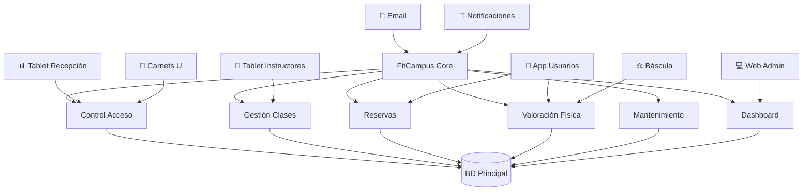

## 2.2 Funciones del Producto

Las funciones principales del sistema están organizadas en los siguientes módulos:

| **Módulo** | **Función Principal** | **Descripción Breve** |
|-------------|----------------------|------------------------|
| Control de Aforo | Monitoreo en tiempo real | Control automático del número de personas mediante registro de entrada/salida en torniquetes. |
| Registro de Accesos | Entrada y salida de usuarios | Registro automático mediante escaneo de carnet universitario con validación de membresía activa. |
| Sistema de Alertas	 | Notificaciones automáticas	 | Alertas cuando se alcanza el 80%, 90% y 100% del aforo máximo (180 personas) |
| Control de Ingreso | Bloqueo automático | mpide nuevo acceso al alcanzar el límite máximo, derivando usuarios a fila virtual |
| Fila Virtual | Espera de usuarios | Sistema de turnos para usuarios cuando el gimnasio está lleno, con notificaciones por app/email |
| Membresías | Administración de usuarios | Registro, renovación y validación automática de membresías integrado con sistema universitario |
| Reserva de Clases | Gestión de cupos	 | Sistema de reservas online para clases grupales con confirmación y recordatorios automáticos |
| Valoración Física | Registro de progreso | Digitalización de evaluaciones físicas con historial y gráficos de evolución para usuarios |
| Reporte de Mantenimiento | Gestión de equipos |Sistema digital para reportar equipos dañados con seguimiento hasta su reparación |
| Reserva de Canchas | Gestión de espacios | Reserva online de canchas deportivas con control de disponibilidad y horarios |
| Dashboard Analítico | Reportes ejecutivos |Generación automática de reportes de uso, asistencia e impacto para dirección |
| Sistema de Notificaciones | Comunicación integral | Envío automático de recordatorios, alertas y notificaciones por múltiples canales |

---

## 2.3 Características de los Usuarios

| **Característica** | **Usuario Tipo 1: Administrador** | **Usuario Tipo 2: Sistema Automático** | **Usuario Tipo 3: Usuario General** |
|----------------------|----------------------------------|----------------------------------------|------------------------------------|
| **Descripción** | Personal encargado de la supervisión del gimnasio. | Personal de control de acceso y atención al usuario. | Estudiantes, docentes y administrativos que usan el gimnasio. |
| **Responsabilidades** | Configurar límites de aforo, gestionar reportes estratégicos, supervisar operación. | Controlar acceso manual, gestionar excepciones, atender consultas en recepción. | Reservar clases y canchas, consultar aforo, reportar equipos dañados. |
| **Nivel Técnico** | Medio | Medio-Bajo| Bajo |
| **Experiencia en el Dominio** | Avanzado |Intermedio| Novato |
| **Frecuencia de Uso** | Diaria | Continua | Semanal |
| **Funciones Principales** | Dashboard ejecutivo, reportes estratégicos, configuración del sistema. | Control de acceso excepciones, consulta de información en tiempo real. | Reservas, consulta de aforo, fila virtual, progreso físico.|
| **Necesidades Especiales** | Acceso remoto, reportes exportables, alertas estratégicas. | nterfaz táctil simple, respuestas rápidas, manejo de multitudes. | App móvil responsive, notificaciones push, proceso sencillo. |

---

## 2.4 Restricciones

| **Tipo de Restricción** | **Descripción** |
|--------------------------|-----------------|
| Técnica | El sistema requiere conexión a Internet y servidor disponible las 24 horas. |
| Seguridad | Todas las contraseñas deben almacenarse cifradas (bcrypt) y los datos sensibles de salud protegidos según Ley 1581 de 2012. |
| Integración | Debe conectarse con torniquetes existentes mediante APIs y con sistema de carnets universitarios para validación de membresías. |
| Legal | Cumplimiento estricto con normas de aforo máximo (180 personas) y protección de datos personales sensibles (peso, medidas, historial de salud). |
| Comunicación |Uso obligatorio del protocolo HTTPS para transmisión segura de datos y JWT para autenticación de usuarios. |
| Presupuesto | Desarrollo limitado a $30,000,000 COP con hardware adicional por $10,000,000 COP (tablets, báscula digital). |
| Tiempo |MVP debe estar operativo en 4 meses, coincidiendo con inicio del programa "Universidad Saludable 2026". |
| Capacitación |Sistema debe permitir adopción gradual con capacitación máxima de 8 horas para personal operativo. |
---

## 2.5 Suposiciones y Dependencias

| **Suposición / Dependencia** | **Descripción** |
|-------------------------------|-----------------|
| Infraestructura | La UDS mantendrá servidores AWS, red WiFi estable en el gimnasio y torniquetes operativos durante el horario de funcionamiento. |
| Base de Datos | Se utilizará PostgreSQL como motor de base de datos relacional, alojado en los servidores AWS de la universidad. |
| Integración con Sistemas Existentes	 | El sistema de carnets universitarios mantendrá su actual formato de código de barras y estará disponible para consultas en tiempo real. |
| Hardware | Los torniquetes existentes son compatibles con control remoto vía API y mantendrán su funcionalidad actual. |
| Personal | Recepcionistas, instructores y coordinadores dispondrán de tiempo para capacitación durante horario laboral. |
| Adopción por Usuarios | Al menos el 70% de los usuarios actuales adoptarán el sistema digital durante los primeros 2 meses de implementación. |
| Datos de Usuarios | La base de datos estudiantil estará disponible para sincronización inicial de 3,400 usuarios registrados. |
| Soporte Técnico | La universidad proporcionará soporte técnico básico para hardware y conectividad después de la implementación. |
| Estabilidad Eléctrica	 | El gimnasio contará con suministro eléctrico estable y planes de contingencia para cortes de energía.|
| Mantenimiento Preventivo	 | El personal técnico del gimnasio ejecutará el mantenimiento preventivo de equipos según la programación establecida. |

---

## 2.6 Requisitos Futuros

| **Código** | **Requisito Futuro** | **Descripción** |
|-------------|----------------------|-----------------|
| RF-F01 | Aplicación móvil nativa | Desarrollo de app nativa para iOS y Android con todas las funcionalidades del sistema. |
| RF-F02 | Sistema de rutinas personalizadas con IA | Generación automática de rutinas de entrenamiento según objetivos, condición física y progreso del usuario. |
| RF-F03 | Integración con wearables | Sincronización con smartwatches y bandas de fitness para seguimiento automático de actividad. |
| RF-F04 | Sistema de gamificación| Implementación de puntos, badges y retos para aumentar engagement y fidelización de usuarios. |
| RF-F05 | Módulo avanzado de nutrición | Planes de alimentación personalizados y seguimiento nutricional integrado con valoraciones físicas. |
| RF-F06 |Video-tutoriales interactivos | Contenido multimedia con QR en equipos para demostrar uso correcto y prevenir lesiones. |
| RF-F07 | Reserva de entrenamiento personalizado |Sistema de agendamiento y pago de sesiones individuales con entrenadores certificados.|
| RF-F08 |Análisis predictivo | IA para predecir horas pico, demanda de clases y necesidades de mantenimiento preventivo. |
| RF-F09 | Comunidad virtual| Red social interna para que usuarios compartan logros, formen grupos y participen en desafíos. |
| RF-F010 | Integración con EPS| Intercambio seguro de datos de salud con entidades promotoras de salud para programas preventivos. |

 

---

## 3 REQUISITOS ESPECÍFICOS

# 3. REQUISITOS FUNCIONALES

## 3.1 Requisitos Funcionales

## 3.1.1 Módulo de Gestión de Membresías

| Campo | Descripción |
|-------|-------------|
| **ID** | RF-001 |
| **Nombre** | Gestión Integral de Usuarios y Membresías |
| **Descripción** | El sistema debe permitir el registro, validación y gestión del estado de membresías de estudiantes, docentes y administrativos, integrado con el sistema de carnets universitario para verificación automática de vigencia. |
| **Prioridad** | Crítica |
| **Estabilidad** | Alta |
| **Fuente** | Problema actual: 3,400 usuarios registrados manualmente sin integración con sistema universitario |
| **Criterios de aceptación** | 1. Integración automática con base de datos estudiantil para validación de carnets 2. Registro inicial de 3,400 usuarios existentes 3. Clasificación por tipo: estudiante (87%), docente (10%), administrativo (3%) 4. Estados: activo, vencido, suspendido, bloqueado 5. Bloqueo automático de acceso para membresías vencidas |
| **Dependencias** | RF-002 (Control de Acceso), RF-003 (Sistema de Alertas) |
| **Comentarios** | Debe cumplir con Ley 1581 de 2012 para protección de datos personales. Registro inicial requiere migración desde cuadernos físicos. |

---

## 3.1.2Control de Acceso y Registro de Aforo

| Campo | Descripción |
|-------|-------------|
| **ID** | RF-002 |
| **Nombre** | Control de Acceso y Registro de Aforo |
| **Descripción** |Sistema automático de registro de entrada/salida mediante torniquetes con código de barras, con conteo en tiempo real del aforo actual y bloqueo automático al alcanzar 180 personas. |
| **Prioridad** | Crítica |
| **Estabilidad** | Alta |
| **Fuente** | Incidente crítico: sobre-aforo sistemático (45 días/semestre) con riesgo legal |
| **Criterios de aceptación** | 1. Registro entrada/salida en < 5 segundos por usuario 2. Conteo exacto en tiempo real con margen de error 0% 3. Bloqueo automático de torniquetes al alcanzar 180 personas 4. Historial completo de accesos por usuario 5. Alertas visuales y sonoras en recepción |
| **Dependencias** | RF-001 (Gestión de Usuarios), Integración con torniquetes existentes |
| **Comentarios** | Protocolo de contingencia para fallos del sistema: registro manual tempora |

---

## 3.1.3  Módulo de Control de Aforo y Accesos

| Campo | Descripción |
|-------|-------------|
| **ID** | RF-003 |
| **Nombre** | Monitoreo de Aforo en Tiempo Reals |
| **Descripción** | Dashboard interactivo que muestra el número exacto de personas dentro del gimnasio, con actualización automática y alertas progresivas de capacidad. |
| **Prioridad** | Crítica |
| **Estabilidad** | Alta |
| **Fuente** | Necesidad de cumplir aforo máximo de 180 personas (normativa bomberos) |
| **Criterios de aceptación** | 1. Actualización en tiempo real (< 2 segundos) 2. Alertas al 80% (144), 90% (162) y 100% (180) de capacidad 3. Visualización en pantallas de recepción y app 4. Histórico de aforo por hora y día 5. Alertas a coordinador y administradores |
| **Dependencias** | RF-002 (Control de Acceso) |
| **Comentarios** | Componente crítico para mitigar riesgo legal por sobre-aforo |

---

## 3.1.4 Sistema de Fila Virtual

| Campo | Descripción |
|-------|-------------|
| **ID** | RF-004 |
| **Nombre** | Sistema de Fila Virtual |
| **Descripción** | Gestión automatizada de turnos de espera cuando el gimnasio alcanza capacidad máxima, con notificaciones a usuarios sobre su posición y tiempo estimado. |
| **Prioridad** | Alta |
| **Estabilidad** | Alta |
| **Fuente** | Problema actual: aglomeraciones físicas en entrada durante horas pico |
| **Criterios de aceptación** | 1. Registro en fila mediante app o recepción 2. Notificaciones cada 15 minutos sobre posición 3. Alerta con 10 minutos de anticipación para ingreso 4. Abandono automático después de 15 min de inacción 5. Máximo 30 personas en fila virtual |
| **Dependencias** | RF-003 (Monitoreo Aforo), RF-010 (Sistema de Notificaciones) |
| **Comentarios** | Reduce aglomeraciones físicas y mejora experiencia de usuario
 |

---

## 3.1.5 Sistema de Reservas de Clases

| Campo | Descripción |
|-------|-------------|
| **ID** | RF-005 |
| **Nombre** | Módulo de Gestión de Clases Grupales |
| **Descripción** | Plataforma digital para reserva de cupos en clases grupales con control estricto de capacidad y confirmación de asistencia. |
| **Prioridad** | Crítica |
| **Estabilidad** | Alta |
| **Fuente** | Problema actual: 42% de ausentismo y sobre-cupo en clases (51 personas en salón de 40) |
| **Criterios de aceptación** | 1. Reserva hasta 24 horas antes de la clase 2. Límite de 3 reservas simultáneas por usuario 3. Cancelación hasta 2 horas antes sin penalización 4. Lista de espera automática para clases llenas 5. Bloqueo por 7 días tras 3 cancelaciones de última hora |
| **Dependencias** | RF-001 (Gestión de Usuarios), RF-010 (Sistema de Notificaciones) |
| **Comentarios** | Meta: reducir ausentismo del 42% al 15% |

---

## 3.1.6 Gestión de Asistencia a Clases

| Campo | Descripción |
|-------|-------------|
| **ID** | RF-006 |
| **Nombre** | Gestión de Asistencia a Clases |
| **Descripción** |Sistema digital para registro de asistencia real en clases por parte de instructores, con validación contra reservas y control de sobre-cupo. |
| **Prioridad** | Alta |
| **Estabilidad** | Alta |
| **Fuente** | Problema actual: listas de papel y sobre-cupo no controlado |
| **Criterios de aceptación** | 1. Registro de asistencia en tablet de instructor 2. Validación contra lista de reservas 3. Bloqueo de ingreso si clase está llena 4. Registro de observaciones por alumno 5. Reporte automático de ausentismo |
| **Dependencias** | RF-005 (Reservas de Clases)|
| **Comentarios** | Elimina listas de papel y controla efectivamente capacidad
 |

---

## 3.1.7 Módulo de Valoración Física

| Campo | Descripción |
|-------|-------------|
| **ID** | RF-007 |
| **Nombre** | Registro Digital de Valoraciones Físicas |
| **Descripción** | Digitalización del proceso de valoración física con historial de progreso, gráficos de evolución y almacenamiento seguro de datos sensibles. |
| **Prioridad** | Media |
| **Estabilidad** | Alta|
| **Fuente** |Problema actual: solo 10% de usuarios con valoración física registrada |
| **Criterios de aceptación** | 1. Captura de peso, altura, IMC, % grasa, perímetros 2. Integración con báscula digital Bluetooth 3. Historial gráfico de evolución 4. Alertas para valoraciones mensuales pendientes 5. Consentimiento explícito para datos sensibles |
| **Dependencias** | RF-001 (Gestión de Usuarios) |
| **Comentarios** | Cumplir Ley 1581 de 2012 para datos sensibles de salud |

---

## 3.1.8 Módulo de Mantenimiento

| Campo | Descripción |
|-------|-------------|
| **ID** | RF-008 |
| **Nombre** | Reporte Digital de Equipos Dañados |
| **Descripción** | Sistema para reporte, seguimiento y gestión de reparación de equipos dañados, con notificaciones a técnicos y seguimiento hasta solución. |
| **Prioridad** | Alta |
| **Estabilidad** | Media |
| **Fuente** | Problema actual: 18 días promedio para reparación de equipos |
| **Criterios de aceptación** |	1. Reporte por usuarios vía app o recepción 2. Notificación inmediata a técnicos 3. Seguimiento de estado: reportado, en reparación, reparado 4. Tiempo promedio de reparación < 3 días 5. Historial de mantenimiento por equipo |
| **Dependencias** | RF-010 (Sistema de Notificaciones) |
| **Comentarios** | Meta: reducir tiempo de reparación de 18 a 3 días |

---

## 3.1.9 Módulo de Reservas de Canchas

| Campo | Descripción |
|-------|-------------|
| **ID** | RF-009 |
| **Nombre** |Sistema de Reserva de Canchas Deportivas |
| **Descripción** | Plataforma para reserva anticipada de canchas deportivas con control de disponibilidad y políticas de uso. |
| **Prioridad** | 	Media |
| **Estabilidad** | Alta |
| **Fuente** |Problema actual: reservas presenciales por orden de llegada |
| **Criterios de aceptación** | 1. Reserva hasta 72 horas antes 2. Límite de 2 reservas semanales por usuario 3. Cancelación hasta 4 horas antes 4. Bloqueo por no-presentación 5. Visualización de disponibilidad en tiempo real |
| **Dependencias** | RF-001 (Gestión de Usuarios) |
| **Comentarios** | Optimiza uso de canchas y reduce conflictos por disponibilidad.|

---

## 3.1.10Módulo de Comunicaciones

| Campo | Descripción |
|-------|-------------|
| **ID** | RF-010 |
| **Nombre** | Sistema de Notificaciones y Alertas|
| **Descripción** | Plataforma centralizada de envío de notificaciones, recordatorios y alertas por múltiples canales (email, SMS, push). |
| **Prioridad** | Alta|
| **Estabilidad** | Alta |
| **Fuente** | Necesidad de reducir ausentismo y mejorar comunicación |
| **Criterios de aceptación** | 1. Recordatorio de clases 2 horas antes 2. Alertas de aforo a coordinadores 3. Notificaciones de fila virtual 4. Recordatorios de valoraciones pendientes 5. Configuración de canales por usuario |
| **Dependencias** | RF-001, RF-003, RF-005 |
| **Comentarios** | Componente clave para mejorar experiencia de usuario. |

---

# 4. CASOS DE USO

## 4.1 Caso de Uso: Controlar Aforo en Tiempo Real

Lista de Casos de Uso del Sistema FitCampus:
CU-001: Controlar Aforo en Tiempo Real
CU-002: Gestionar Reserva de Clases Grupales
CU-003: Registrar Valoración Física
CU-004: Reportar Equipo Dañado
CU-005: Gestionar Fila Virtual
CU-006: Generar Reportes de Impacto
CU-007: Validar Acceso de Usuario
CU-008: Gestionar Membresías
CU-009: Programar Horario de Clases
CU-010: Tomar Asistencia a Clases

## CU-001: Controlar Aforo en Tiempo Real

| Campo | Descripción |
|-------|-------------|
| **ID** | CU-001 |
| **Nombre** | Controlar Aforo en Tiempo Real |
| **Actores** | Sistema Automático (primario), Recepcionista (secundario), Coordinador (secundario)|
| **Descripción** | Permite al sistema monitorear y controlar automáticamente el número de personas dentro del gimnasio, garantizando que nunca se supere el límite máximo de 180 personas. |
| **Precondiciones** | 1. Sistema operativo y conectado a internet 2. Torniquetes funcionando correctamente 3. Base de datos de usuarios sincronizada 4. Aforo inicial correctamente calibrado |
| **Postcondiciones** | 1. Contador de aforo actualizado con precisión 2. Alertas generadas según protocolo establecido 3. Historial de accesos registrado en base de datos 4. Usuarios informados sobre estado de capacidad |
| **Flujo Principal** | 1. Usuario escanea carnet en torniquete de entrada 2. Sistema valida membresía activa en base de datos 3. Sistema registra entrada y incrementa contador de aforo 4. Sistema actualiza dashboard en tiempo real (< 2 segundos) 5. Sistema verifica niveles de alerta (80%, 90%, 100%) 6. Sistema notifica actores según protocolo establecido 7. Usuario completa ingreso, torniquete se libera |
| **Flujos Alternativos** | a. Alcanzar 80% de capacidad (144 personas): 4a1. Sistema activa alerta amarilla en dashboard 4a2. Notifica a recepcionistas y coordinador 4a3. Muestra indicador visual en recepción 4b. Alcanzar 90% de capacidad (162 personas): 4b1. Sistema activa alerta naranja en dashboard 4b2. Notifica por push a administrador y coordinador 4b3. Activa sonido intermitente en recepción |
| **Flujos de Excepción** | 3a. Error en detección de entrada/salida: 3a1. Sistema genera registro de evento de error 3a2. Notifica a recepcionista para validación manual 3a3. Recepcionista corrige aforo manualmente si es necesario 6a. Sistema de torniquetes offline: 6a1. Sistema activa modo contingencia manual 6a2. Recepcionista registra accesos manualmente en tablet 6a3. Sistema sincroniza datos cuando se restablece conexión |
| **Requisitos Relacionados** | RF-001 (Gestión de Usuarios) RF-002 (Control de Acceso) RF-003 (Monitoreo de Aforo) RNF-004 (Integridad transaccional) RNFR-001 (Tiempo de respuesta) |

# Diagramas de Casos de Uso - FitCampus

## CU-001: Controlar Aforo en Tiempo Real

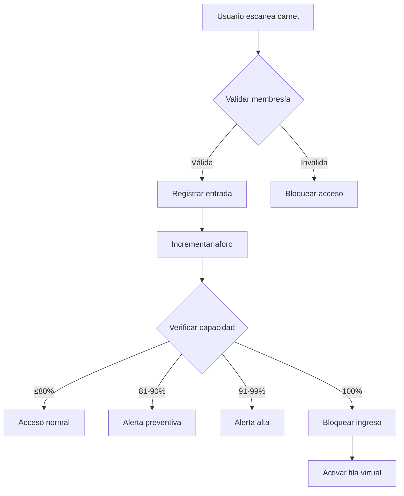

---

## CU-002: Gestionar Reserva de Clases Grupales

| Campo | Descripción |
|-------|-------------|
| **ID** | CU-002 |
| **Nombre** | Gestionar Reserva de Clases Grupales |
| **Actores** |Usuario (primario), Sistema Automático (secundario), Instructor (secundario))|
| **Descripción** | Permite a los usuarios reservar cupos en clases grupales con control de capacidad y sistema de confirmación para reducir el ausentismo. |
| **Precondiciones** |1. Cupo reservado y confirmado para el usuario 2. Instructor recibe lista actualizada de inscritos 3. Sistema registra la reserva en base de datos|
| **Postcondiciones** | 1. Contador de aforo actualizado con precisión 2. Alertas generadas según protocolo establecido 3. Historial de accesos registrado en base de datos 4. Usuarios informados sobre estado de capacidad |
| **Flujo Principal** | 1. Usuario consulta horario de clases disponibles 2. Sistema muestra clases con cupos disponibles en tiempo real 3. Usuario selecciona clase y confirma reserva 4. Sistema valida que no tenga reservas conflictivas 5. Sistema bloquea cupo temporalmente (15 min para confirmación) 6. Envía confirmación inmediata al usuario 7. Registra reserva en base de datos 8. Envía recordatorio 2 horas antes de la clasea |
| **Flujos Alternativos** | 3a. Clase está llena: 3a1. Sistema ofrece unirse a lista de espera 3a2. Usuario confirma ingreso a lista 3a3. Sistema notifica si se libera cupo 5a. Usuario no confirma en 15 minutos: 5a1. Sistema libera cupo automáticamente 5a2. Notifica siguiente en lista de espera |
| **Flujos de Excepción** | 4a. Usuario tiene reserva conflictiva: 4a1. Sistema muestra mensaje "Ya tiene reserva en horario similar" 4a2. Ofrece opción de cancelar reserva anterior 4a3. Si usuario cancela, procede con nueva reserva |
| **Requisitos Relacionados** | RF-005 (Sistema de Reservas de Clases) RF-010 (Sistema de Notificaciones) RNFF-004 (Integridad transaccional) |

## CU-002: Gestionar Reserva de Clases Grupales

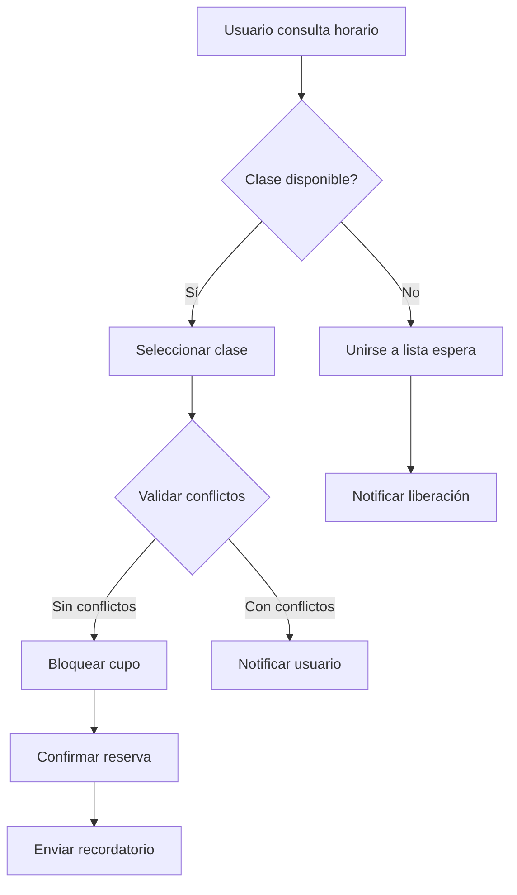

## CU-003: Registrar Valoración Física

| Campo | Descripción |
|-------|-------------|
| **ID** | CU-003 |
| **Nombre** | Registrar Valoración Física |
| **Actores** | Entrenador (primario), Usuario (secundario), Sistema Automático (secundario) |
| **Descripción** | Digitaliza el proceso de valoración física con registro de medidas, cálculos automáticos e historial de progreso. |
| **Precondiciones** | 1. Entrenador ha iniciado sesión en el sistema 2. Usuario tiene membresía activa 3. Usuario ha dado consentimiento para almacenar datos de salud |
| **Postcondiciones** | 	1. Valoración física registrada digitalmente 2. Historial de progreso actualizado 3. Próxima cita programada automáticamente |
| **Flujo Principal** | 1. Entrenador selecciona usuario en sistema 2. Sistema muestra historial previo (si existe) 3. Entrenador ingresa medidas (peso, altura, perímetros) 4. Sistema calcula automáticamente IMC, % grasa estimado 5. Integración con báscula digital vía Bluetooth 6. Sistema genera gráficos de progreso 7. Almacena valoración con fecha y firma digital 8. Programa próxima valoración (30 días) |
| **Flujos Alternativos** | 5a. Báscula no disponible: 5a1. Sistema permite ingreso manual de peso 5a2. Entrenador ingresa peso manualmente 5a3. Sistema procede con cálculos normales |
| **Flujos de Excepción** | 2a. Usuario sin valoraciones previas: 2a1. Sistema muestra formulario de valoración inicial 2a2. Entrenador completa datos antropométricos base 2a3. Sistema establece línea base para seguimiento|
| **Requisitos Relacionados** | RF-007 (Registro de Valoraciones Físicas) RNFS-001 (Protección de datos sensibles) RNFS-006 (Cumplimiento normativo) |

## CU-003: Registrar Valoración Física

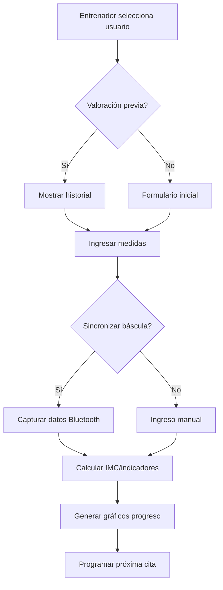

## CU-004: Reportar Equipo Dañado

| Campo | Descripción |
|-------|-------------|
| **ID** | CU-004 |
| **Nombre** | Reportar Equipo Dañado |
| **Actores** | Usuario (primario), Técnico (secundario), Sistema Automático (secundario) |
| **Descripción** | Sistema digital para reportar equipos dañados con seguimiento hasta su reparación. |
| **Precondiciones** | 1. Usuario identificado en el sistema 2. Equipo existe en inventario del gimnasio 3. Sistema operativo y conectado |
| **Postcondiciones** | 1. Equipo marcado como "Fuera de servicio" 2. Ticket de mantenimiento creado y asignado 3. Técnico notificado para acción inmediata |
| **Flujo Principal** | 1. Usuario selecciona "Reportar equipo" en app o tablet recepción 2. Sistema muestra inventario de equipos con ubicación 3. Usuario selecciona equipo dañado y describe problema 4. Sistema asigna ticket único con prioridad automática 5. Notifica inmediatamente a técnicos disponibles 6. Técnico recibe alerta en tablet con detalles 7. Sistema registra estado: Reportado → En reparación → Reparado 8. Notifica a usuario cuando equipo está disponible |
| **Flujos Alternativos** | 3a. Equipo no encontrado en inventario: 3a1. Sistema permite reporte manual con descripción 3a2. Recepcionista asigna ubicación y categoría 3a3. Sistema genera ticket con verificación pendiente|
| **Flujos de Excepción** |5a. Ningún técnico disponible: 5a1. Sistema asigna ticket a "Cola de mantenimiento" 5a2. Notifica a coordinador para asignación manual 5a3. Establece fecha estimada de revisión |
| **Requisitos Relacionados** | RF-008 (Reporte Digital de Equipos) RNFF-002 (Manejo robusto de errores) RNFD-005 (Degradación controlada) |

## CU-004: Reportar Equipo Dañado

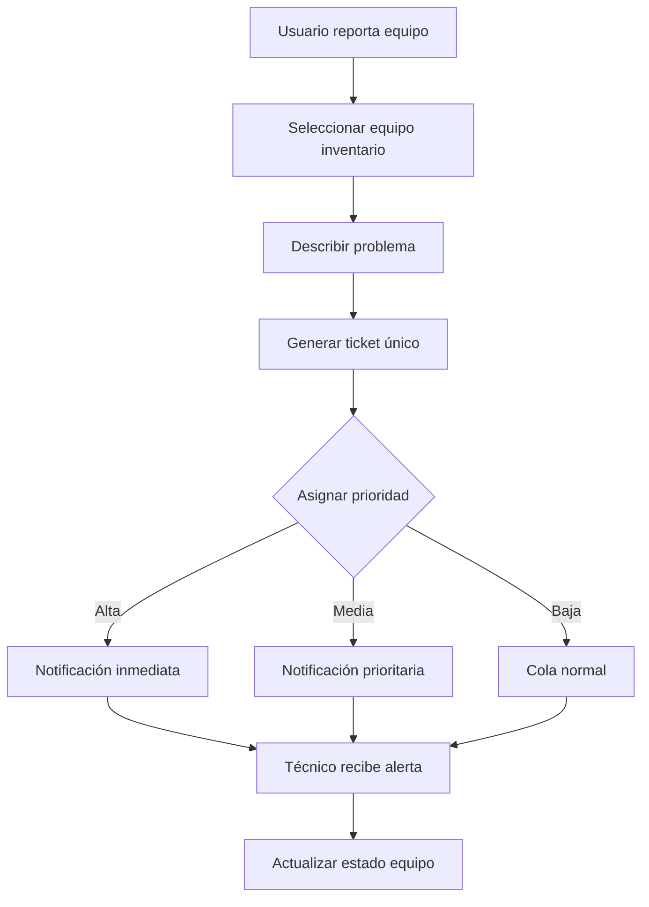

## CU-005: Gestionar Fila Virtual

| Campo | Descripción |
|-------|-------------|
| **ID** | CU-005 |
| **Nombre** | Gestionar Fila Virtual |
| **Actores** | Sistema Automático (primario), Usuario (secundario), Recepcionista (secundario)|
| **Descripción** | Gestiona lista de espera cuando el gimnasio alcanza capacidad máxima. |
| **Precondiciones** | 1. Aforo al 100% (180 personas) 2. Sistema de notificaciones operativo 3. Usuarios solicitando acceso |
| **Postcondiciones** | 1. Fila virtual activa y gestionada 2. Usuarios en espera notificados adecuadamente 3. Ingreso ordenado cuando se liberan cupos |
| **Flujo Principal** |1. Sistema detecta aforo completo (180 personas) 2. Ofrece opción "Unirse a fila virtual" en app y pantallas 3. Usuario ingresa a fila con posición y tiempo estimado 4. Sistema notifica cada 15 minutos sobre posición 5. Cuando se libera cupo, notifica al siguiente usuario 6. Reserva cupo por 10 minutos para ingreso 7. Si no ingresa en tiempo, pasa al siguiente |
| **Flujos Alternativos** | 3a. Usuario abandona fila: 3a1. Sistema elimina usuario de la fila 3a2. Reorganiza posiciones de los demás 3a3. Notifica siguiente usuario si corresponde |
| **Flujos de Excepción** | 6a. Múltiples cupos liberados simultáneamente: 6a1. Sistema notifica a varios usuarios según posición 6a2. Asigna cupos en orden de llegada a la fila 6a3. Actualiza estado de aforo en tiempo real |
| **Requisitos Relacionados** | RF-004 (Sistema de Fila Virtual)
RF-010 (Sistema de Notificaciones)
RNFR-001 (Tiempos de respuesta críticos) |

## CU-005: Gestionar Fila Virtual

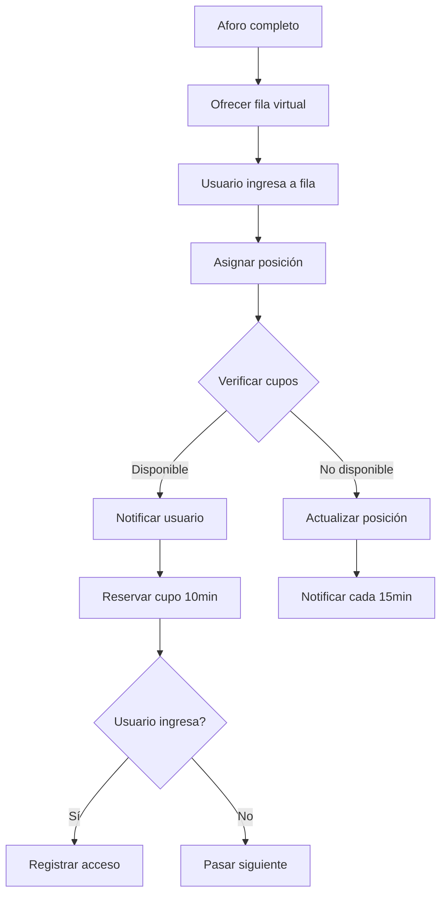

| Campo | Descripción |
|-------|-------------|
| **ID** | CU-006 |
| **Nombre** | Generar Reportes de Impacto |
| **Actores** | Administrador (primario), Sistema Automático (secundario) |
| **Descripción** | Genera reportes automáticos para dirección sobre uso del gimnasio e impacto en salud. |
| **Precondiciones** | 1. Administrador autenticado con permisos 2. Datos históricos disponibles en el sistema 3. Período de reporte definido |
| **Postcondiciones** |1. Reporte generado y disponible para descarga 2. Datos consolidados para presentación a rectoría 3. Base para toma de decisiones estratégicas |
| **Flujo Principal** | 1. Administrador selecciona tipo de reporte y período 2. Sistema consolida datos de múltiples fuentes 3. Genera métricas clave: usuarios activos, frecuencia, retención 4. Calcula indicadores de salud agregados (evolución IMC promedio) 5. Genera visualizaciones gráficas y tablas 6. Exporta en formatos PDF/Excel 7. Programa reportes recurrentes automáticos |
| **Flujos Alternativos** | 2a. Datos insuficientes para período: 2a1. Sistema sugiere período alternativo con datos completos 2a2. Genera reporte parcial con advertencia 2a3. Ofrece opción de incluir datos estimados |
| **Flujos de Excepción** | 5a. Error en generación de gráficos: 5a1. Sistema genera reporte en formato tabla simple 5a2. Notifica error al administrador 5a3. Registra incidencia para corrección técnica |
| **Requisitos Relacionados** | RF-006 (Dashboard Analítico) RNFS-008 (Protección de datos personales) RNFM-005 (Logs para diagnóstico) |

## CU-006: Generar Reportes de Impacto

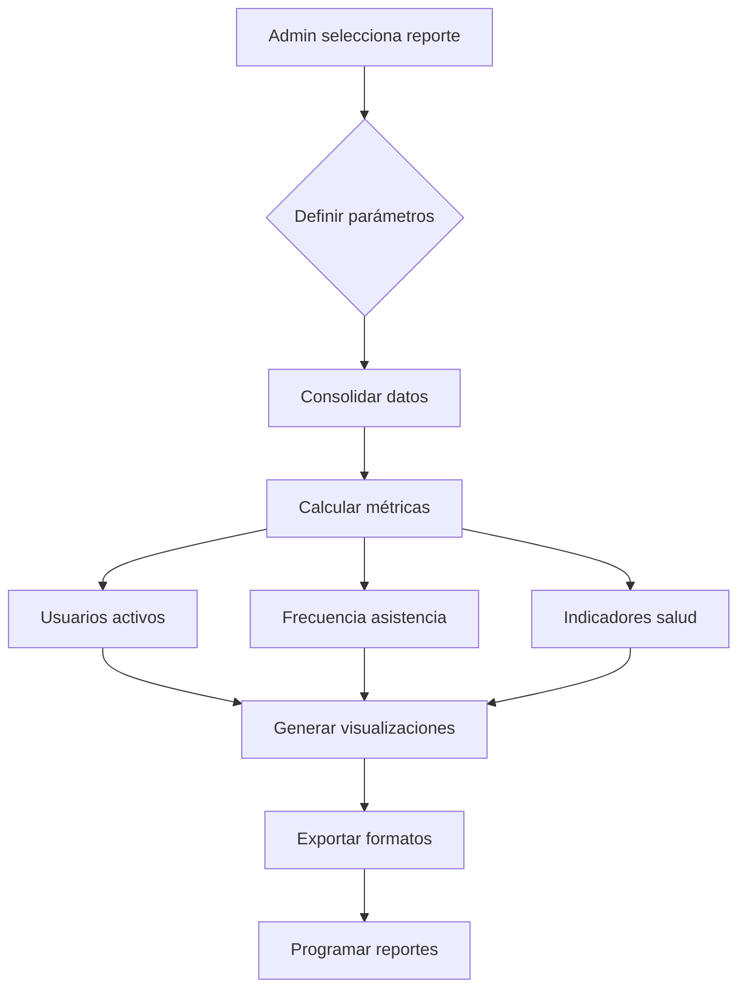

CU-007: Validar Acceso de Usuario

| Campo | Descripción |
|-------|-------------|
| **ID** | CU-007 |
| **Nombre** | Validar Acceso de Usuario |
| **Actores** | Sistema Automático (primario), Usuario (secundario), Recepcionista (secundario) |
| **Descripción** | Valida el acceso de usuarios mediante escaneo de carnet y verificación de membresía. |
| **Precondiciones** | 	1. Sistema operativo y conectado 2. Lector de códigos de barras funcionando 3. Base de datos de usuarios accesible |
| **Postcondiciones** | 1. Acceso permitido o denegado según validación 2. Registro de intento de acceso almacenado 3. Usuario notificado del resultado |
| **Flujo Principal** | 1. Usuario presenta carnet universitario en torniquete 2. Sistema escanea código de barras 3. Valida formato del código 4. Consulta estado de membresía en base de datos 5. Verifica que no tenga restricciones de acceso 6. Permite acceso y registra entrada
7. Actualiza contador de aforo|
| **Flujos Alternativos** | 	4a. Membresía vencida: 4a1. Sistema bloquea acceso 4a2. Muestra mensaje "Membresía vencida" 4a3. Deriva a recepción para renovación |
| **Flujos de Excepción** | 	2a. Código de barras ilegible: 2a1. Sistema solicita reintento de escaneo 2a2. Si persiste el error, deriva a recepción para validación manual |
| **Requisitos Relacionados** | RF-001, RF-002, RNFS-004 |

##CU-007: Validar Acceso de Usuario

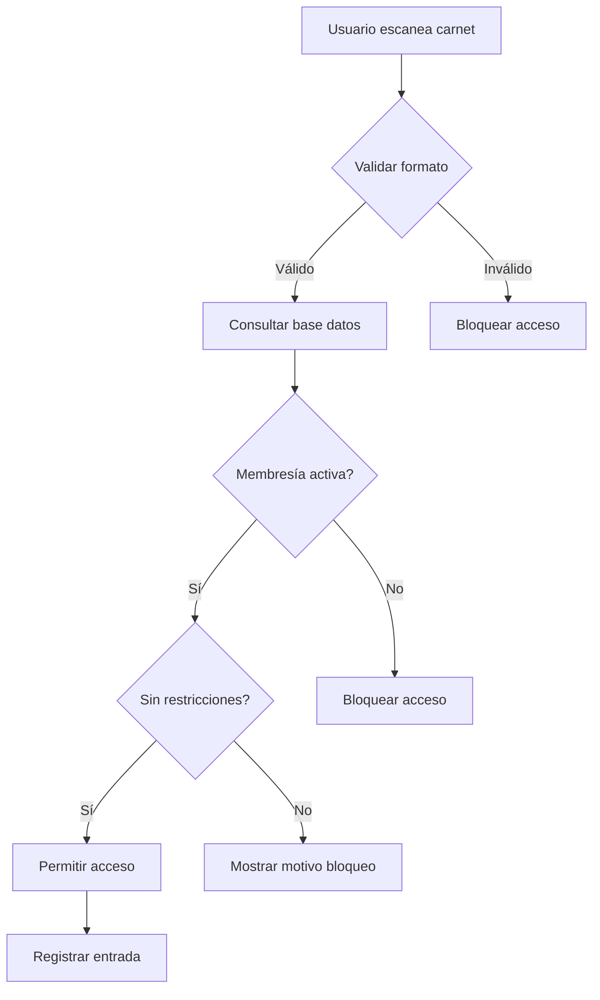

CU-008: Gestionar Membresías

| Campo | Descripción |
|-------|-------------|
| **ID** | CU-008 |
| **Nombre** | Gestionar Membresías |
| **Actores** |Administrador (primario), Sistema Automático (secundario), Usuario (secundario) |
| **Descripción** |Permite la gestión integral de membresías de usuarios del gimnasio. |
| **Precondiciones** | 1. Administrador autenticado con permisos 2. Sistema integrado con base de datos universitaria 3. Usuario existe en sistema universitario |
| **Postcondiciones** |1. Estado de membresía actualizado 2. Historial de cambios registrado 3. Usuario notificado de cambios relevantes |
| **Flujo Principal** |1. Administrador busca usuario por código o nombre 2. Sistema muestra información actual de membresía 3. Administrador selecciona acción (activar, suspender, renovar) 4. Sistema valida que la acción sea permitida 5. Ejecuta cambio de estado de membresía 6. Registra cambio en historial con timestamp 7. Notifica al usuario si corresponde 8. Actualiza base de datos |
| **Flujos Alternativos** | 3a. Renovación de membresía: 3a1. Sistema calcula nueva fecha de vencimiento 3a2. Actualiza estado a "Activa" 3a3. Envía confirmación de renovación |
| **Flujos de Excepción** |4a. Acción no permitida: 4a1. Sistema muestra motivo de restricción 4a2. Sugiere acción alternativa 4a3. Cancela operación actual] |
| **Requisitos Relacionados** | RF-001, RNFS-005, RNFS-006 |

CU-008: Gestionar Membresías

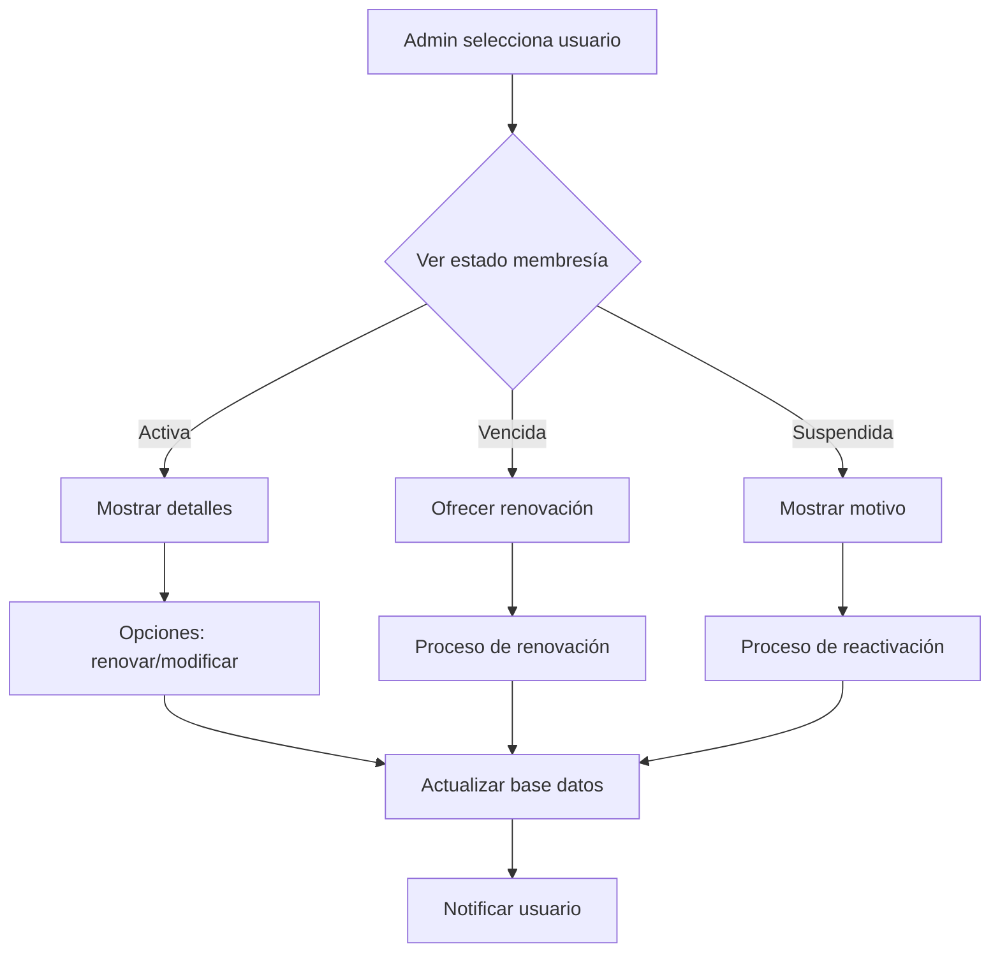

| Campo | Descripción |
|-------|-------------|
| **ID** | CU-009 |
| **Nombre** | Programar Horario de Clases |
| **Actores** | Coordinador (primario), Sistema Automático (secundario), Instructor (secundario)|
| **Descripción** |Permite programar y gestionar el horario semanal de clases grupales. |
| **Precondiciones** | 1. Coordinador autenticado con permisos 2. Instructores registrados en el sistema 3. Salones y equipos disponibles en inventario |
| **Postcondiciones** | 1. Horario semanal publicado y visible 2. Instructores asignados a clases 3. Capacidades y restricciones configuradas |
| **Flujo Principal** | 1. Coordinador accede a módulo de programación 2. Sistema muestra horario actual y disponibilidad 3. Coordinador selecciona fecha, hora y tipo de clase 4. Asigna instructor disponible 5. Define capacidad máxima del salón 6. Configura restricciones específicas 7. Sistema valida que no haya conflictos 8. Publica clase en horario semanal 9. Notifica a instructor asignado |
| **Flujos Alternativos** | 7a. Conflicto de horario detectado: 7a1. Sistema muestra conflicto específico 7a2. Sugiere horarios alternativos disponibles 7a3. Coordinador ajusta horario o instructor |
| **Flujos de Excepción** | 4a. Instructor no disponible: 4a1. Sistema muestra instructores disponibles 4a2. Coordinador selecciona instructor alternativo 4a3. Sistema reasigna clase |
| **Requisitos Relacionados** | RF-005, RNFF-003, RNFM-003 |

##CU-009: Programar Horario de Clases

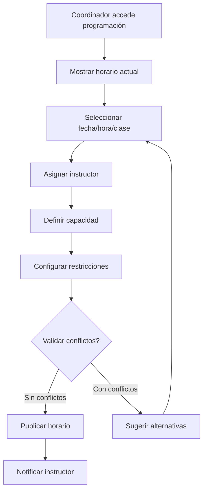

| Campo | Descripción |
|-------|-------------|
| **ID** | CU-010 |
| **Nombre** | Tomar Asistencia a Clases |
| **Actores** | Instructor (primario), Sistema Automático (secundario), Usuario (secundario) |
| **Descripción** | Registra la asistencia real de usuarios a clases grupales y controla el acceso al salón. |
| **Precondiciones** | 1. Instructor autenticado en el sistema 2. Clase programada en horario 3. Lista de reservas disponible 4. Tablet operativa con conexión |
| **Postcondiciones** | 1. Asistencia registrada para todos los participantes 2. Control de acceso al salón ejecutado 3. Reporte de ausentismo generado 4. Historial de asistencia actualizado|
| **Flujo Principal** | 1. 1. Instructor accede a lista de clase en tablet 2. Sistema muestra lista de usuarios con reserva 3. Usuario presenta carnet para registro 4. Instructor escanea código o selecciona manualmente 5. Sistema marca asistencia y registra timestamp 6. Controla que no se exceda capacidad del salón 7. Genera reporte de asistencia al finalizar clase 8. Actualiza historial de frecuencia de usuarios |
| **Flujos Alternativos** | 3a. Usuario sin reserva intenta ingresar: 3a1. Sistema verifica si hay cupos disponibles 3a2. Si hay cupo, permite ingreso y registra como "walk-in" 3a3. Si no hay cupo, niega el acceso |
| **Flujos de Excepción** | 4a. Error de conexión en tablet: 4a1. Sistema permite modo offline temporal 4a2. Instructor registra asistencia localmente 4a3. Tablet sincroniza datos al recuperar conexión |
| **Requisitos Relacionados** | RF-005, RF-006, RNFD-005 |

## CU-010: Tomar Asistencia a Clase

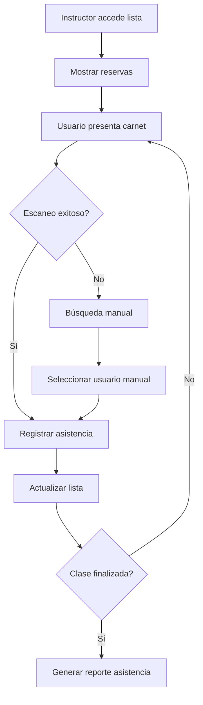

---

### 4.2 Glosario

**4.4.1 Matriz Requisitos - Casos de Uso**

| Requisito | Caso de Uso Relacionado | Prioridad |
|-----------|-------------------------|-----------|
| RF-001 | CU-000 (Login) | Esencial |
| RF-010 | CU-003 (Registrar Usuario) | Esencial |
| RF-030 | CU-001 (Realizar Préstamo) | Esencial |
| RF-031 | CU-001 (Realizar Préstamo) | Esencial |
| RF-040 | CU-002 (Realizar Devolución) | Esencial |
| ... | ... | ... |

**4.4.2 Matriz Requisitos - Casos de Prueba**

| Requisito | Casos de Prueba | Estado Prueba |
|-----------|-----------------|---------------|
| RF-001 | TC-001, TC-002, TC-003 | Pendiente |
| RF-002 | TC-004, TC-005 | Pendiente |
| RF-010 | TC-010, TC-011, TC-012, TC-013 | Pendiente |
| ... | ... | ... |

[Esta matriz se completará durante la fase de pruebas]

 

*Plantilla elaborada con propósitos académicos*  
*Basada en IEEE Std 830-1998*  
*Versión  1.0 - Octubre 2025*
