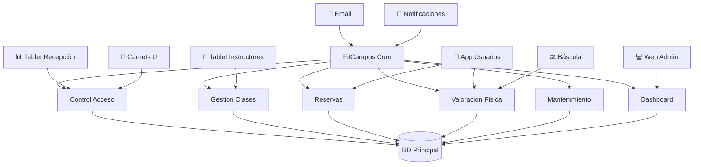
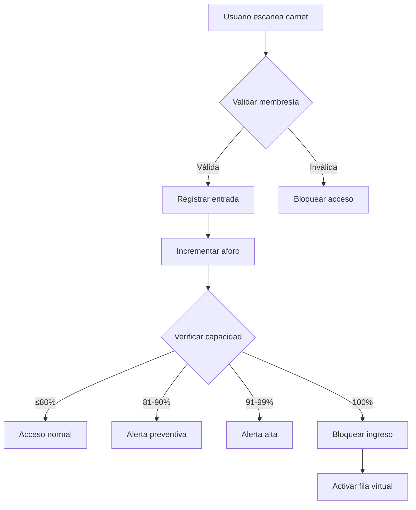
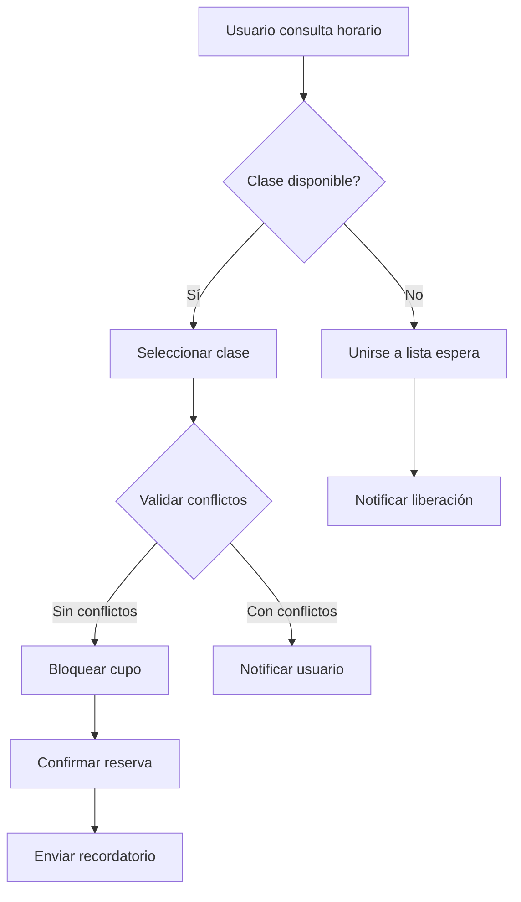
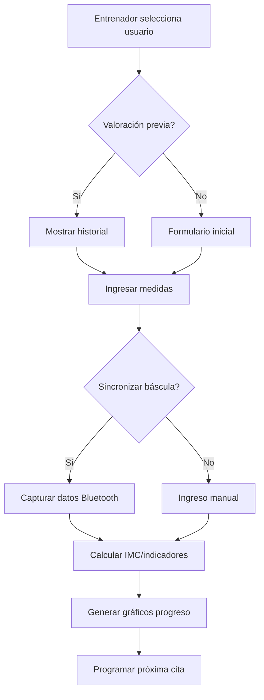

# Especificación de Requisitos de Software (SRS)
### Proyecto: 🏋️ CASO DE ESTUDIO: SISTEMA DE GESTIÓN PARA GIMNASIO UNIVERSITARIO "FITCAMPUS"
*Versión [1.0]*

 

*Octubre/2025*

 

> **Nota Aclaratoria:**  
> Este documento fue elaborado con fines académicos como parte de una práctica formativa bajo el estándar IEEE 830-1998.
> Todos los datos, nombres de entidades, diagramas y estructuras de base de datos son simulados y no corresponden a información real.
> Este documento tiene propósitos educativos y está diseñado para enseñar la correcta especificación de requisitos de software.

 

> **Instrucciones para el Estudiante:**  
> - Elimine todos los comentarios HTML `<!-- ... -->` en la versión final
> - Reemplace todo el texto entre `[corchetes]` con información real de su proyecto
> - Utilice las tablas y formatos sugeridos como guía
> - Revise el checklist de calidad antes de entregar
> - Mantenga la numeración y estructura del estándar IEEE 830

 

**Control de Versiones:**

| Versión | Fecha | Autor | Descripción de Cambios |
|---------|-------|-------|------------------------|
| 1.0 | [DD/MM/AAAA] | [Nombre] | Versión inicial del documento |
| | | | |

 

---

## CONTENIDO

- [1 INTRODUCCIÓN](#1-introducción)
  - [1.1 Propósito](#11-propósito)
  - [1.2 Alcance](#12-alcance)
  - [1.3 Personal involucrado](#13-personal-involucrado)
  - [1.4 Definiciones, acrónimos y abreviaturas](#14-definiciones-acrónimos-y-abreviaturas)
  - [1.5 Referencias](#15-referencias)
  - [1.6 Resumen](#16-resumen)
- [2 DESCRIPCIÓN GENERAL](#2-descripción-general)
  - [2.1 Perspectiva del producto](#21-perspectiva-del-producto)
  - [2.2 Funciones del producto](#22-funciones-del-producto)
  - [2.3 Características de los usuarios](#23-características-de-los-usuarios)
  - [2.4 Restricciones](#24-restricciones)
  - [2.5 Suposiciones y dependencias](#25-suposiciones-y-dependencias)
  - [2.6 Requisitos futuros](#26-requisitos-futuros)
- [3 REQUISITOS ESPECÍFICOS](#3-requisitos-específicos)
  - [3.1 Requisitos funcionales](#31-requisitos-funcionales)
  - [3.2 Requisitos de interfaz externa](#32-requisitos-de-interfaz-externa)
    - [3.2.1 Interfaz de usuario](#321-interfaz-de-usuario)
    - [3.2.2 Interfaz de hardware](#322-interfaz-de-hardware)
    - [3.2.3 Interfaz de software](#323-interfaz-de-software)
    - [3.2.4 Interfaz de comunicación](#324-interfaz-de-comunicación)
  - [3.3 Requisitos no funcionales](#33-requisitos-no-funcionales)
    - [3.3.1 Rendimiento](#331-rendimiento)
    - [3.3.2 Fiabilidad](#332-fiabilidad)
    - [3.3.3 Disponibilidad](#333-disponibilidad)
    - [3.3.4 Seguridad](#334-seguridad)
    - [3.3.5 Mantenibilidad](#335-mantenibilidad)
    - [3.3.6 Portabilidad](#336-portabilidad)
  - [3.4 Requisitos de diseño](#34-requisitos-de-diseño)
  - [3.5 Requisitos de calidad](#35-requisitos-de-calidad)
  - [3.6 Restricciones del sistema](#36-restricciones-del-sistema)
  - [3.7 Atributos del sistema](#37-atributos-del-sistema)
- [4 APÉNDICES](#4-apéndices)
  - [4.1 Modelos de casos de uso](#41-modelos-de-casos-de-uso)
  - [4.2 Glosario](#42-glosario)
  - [4.3 Diagramas del sistema](#43-diagramas-del-sistema)
  - [4.4 Matriz de trazabilidad](#44-matriz-de-trazabilidad)
  - [4.5 Criterios de evaluación](#45-criterios-de-evaluación)

 

---

# 1. INTRODUCCIÓN

## 1.1 Propósito

Este documento constituye la Especificación de Requisitos de Software (SRS) para el Sistema de Gestión del Gimnasio Universitario "FitCampus", desarrollado según el estándar IEEE 830-1998.

El propósito fundamental es establecer una definición clara, completa y verificable de los requisitos que debe cumplir el sistema para resolver los problemas críticos identificados en la operación actual del gimnasio de la Universidad del Sur (UDS)

La siguiente tabla resume cómo cada actor utilizará este documento:

| **Actor** | **Uso del Documento** |
|------------|----------------------|
| Desarrolladores | mplementan las funcionalidades definidas, asegurando que el sistema cumpla con los requisitos funcionales y no funcionales. |
| Analistas | Validan que los requisitos respondan efectivamente a los problemas actuales del gimnasio y a las necesidades del cliente. |
| Cliente (Dirección de Bienestar y Deportes) | Verifica que el sistema FitCampus solucione los problemas críticos: control de aforo, accesos, mantenimiento, reportes, fila virtual, valoración física y experiencia del usuario. |
| Equipo QA | Diseña casos de prueba y planes de validación basados en los requisitos especificados. |
| Coordinadores Gimnasio |Comprende los nuevos flujos operativos y prepara la capacitación del equipo |
| Patrocinadores (Rectoría) |Evalúa el retorno de inversión y impacto estratégico del sistema |
---

## 1.2 Alcance

El sistema FitCampus gestionará de forma integral el aforo en tiempo real del gimnasio universitario. Para lograrlo, registrará automáticamente la entrada y salida de los usuarios por medio de sensores instalados en los torniquetes de acceso, el cual actualiza de inmediato el conteo de personas dentro del gimnasio.

Además del control de aforo, el sistema permitirá:

Administrador: supervisa el estado del gimnasio, gestiona membresías, consulta reportes, y configura límites de aforo.

Sistema Automático: procesa los eventos de entrada/salida, actualiza el conteo de aforo y genera alertas.

Usuario General: consulta su membresía, verifica el aforo en tiempo real y accede a la fila virtual cuando el gimnasio está lleno.

Recepcionista: controla accesos manuales, gestiona excepciones y consulta información en tiempo real.

Instructor: gestiona listas de clases, toma asistencia y consulta su horario semanal.

Coordinador: programa horarios de clases, asigna instructores y genera reportes operativos.

### Objetivos principales
| **Objetivo** | **Descripción** |
|---------------|-----------------|
| Control de Aforo | Evitar sobreocupación del gimnasio y garantizar seguridad. |
| Automatización |Eliminar procesos manuales de registro, reducir errores humanos y optimizar tiempos de atención. |
| Gestión de Membresías | Llevar control automático de usuarios activos, vencidos y bloqueados. |
| Monitoreo en Tiempo Real | Proveer información instantánea sobre aforo, estado del acceso y alertas. |
| Fila Virtual Inteligente | Permitir que los usuarios esperen su turno sin aglomeraciones físicas en la entrada. |
| Gestión de Clases Grupales | Controlar cupos, reducir ausentismo y eliminar sobre-cupo mediante sistema de reservas digital. |
| Seguimiento de Progreso Físico| Digitalizar valoraciones físicas y proporcionar historial de evolución a los usuarios. |
| Mantenimiento de Equipos | Agilizar reporte y reparación de equipos dañados mediante sistema digital con seguimiento. |

---

## 1.3 Definiciones, Acrónimos y Abreviaturas

| **Término / Acrónimo** | **Definición** |
|--------------------------|----------------|
| **SRS** | Software Requirements Specification (Documento de Requisitos de Software). |
| **RF** | Requisito Funcional. |
| **RNF** | Requisito No Funcional. |
| **JWT** | JSON Web Token, usado para autenticación segura. |
| **HTTPS** | Protocolo de comunicación segura entre el cliente y el servidor. |
| **FitControl** | Nombre del sistema de control de aforo del gimnasio. |
| **UDS** | Universidad del Sur, institución cliente del sistema.|
| **MVP** | Producto Mínimo Viable, versión inicial con funcionalidades críticas. |
| **ACS** | Sistema de Control de Aforo, módulo principal del FitCampus. |
| **API** | Application Programming Interface, para integración entre sistemas. |
| **RFID** | Identificación por Radiofrecuencia, tecnología para control de acceso |
| **NFC	** | Near Field Communication, comunicación de corto alcance para carnets. |
| **IMC	** | Índice de Masa Corporal, métrica de valoración física. |
| **KPI** | Key Performance Indicator, indicador clave de rendimiento. |
| **EPS	** | Entidad Promotora de Salud, aliado externo del programa de salud. |

---

## 1.4 Referencias

| **Referencia** | **Descripción / Fuente** |
|-----------------|--------------------------|
| IEEE Std 830-1998 | *IEEE Recommended Practice for Software Requirements Specifications*. |
| Universidad Nacional del Valle | Requerimientos funcionales definidos por el gimnasio universitario. |
| Documento de Requisitos del Cliente | Base para la especificación funcional. |
| Diagrama de Casos de Uso – FitControl | Diseño visual de las interacciones del sistema. |

---

## 1.5 Visión General del Documento

Este documento está dividido en secciones que describen los diferentes aspectos del sistema:

| **Sección** | **Contenido** |
|--------------|----------------|
| **1. Introducción** | Propósito, alcance y términos clave del sistema. |
| **2. Descripción General** |Contexto del gimnasio, usuarios involucrados, funciones globales y restricciones. |
| **3. Requisitos Específicos** | Requisitos funcionales y no funcionales del sistema. |
| **4. Casos de Uso** | Descripciones formales de las interacciones entre actores y el sistema. |

El propósito de esta estructura es mantener la documentación organizada, comprensible y fácil de actualizar conforme evolucione el proyecto.

 

---

---

## 2.1 perspectiva del producto

Contexto del Sistema FitCampus
El Sistema FitCampus es una solución de software integral diseñada para transformar la gestión operativa del Gimnasio Universitario de la UDS. Se conceptualiza como un ecosistema digital centralizador que reemplaza los procesos manuales actuales basados en papel, proporcionando automatización, control en tiempo real y análisis de datos para toda la operación del gimnasio.

# Diagrama de Contexto - FitCampus

## 2.2 Funciones del Producto

Las funciones principales del sistema están organizadas en los siguientes módulos:

| **Módulo** | **Función Principal** | **Descripción Breve** |
|-------------|----------------------|------------------------|
| Control de Aforo | Monitoreo en tiempo real | Control automático del número de personas mediante registro de entrada/salida en torniquetes. |
| Registro de Accesos | Entrada y salida de usuarios | Registro automático mediante escaneo de carnet universitario con validación de membresía activa. |
| Sistema de Alertas	 | Notificaciones automáticas	 | Alertas cuando se alcanza el 80%, 90% y 100% del aforo máximo (180 personas) |
| Control de Ingreso | Bloqueo automático | mpide nuevo acceso al alcanzar el límite máximo, derivando usuarios a fila virtual |
| Fila Virtual | Espera de usuarios | Sistema de turnos para usuarios cuando el gimnasio está lleno, con notificaciones por app/email |
| Membresías | Administración de usuarios | Registro, renovación y validación automática de membresías integrado con sistema universitario |
| Reserva de Clases | Gestión de cupos	 | Sistema de reservas online para clases grupales con confirmación y recordatorios automáticos |
| Valoración Física | Registro de progreso | Digitalización de evaluaciones físicas con historial y gráficos de evolución para usuarios |
| Reporte de Mantenimiento | Gestión de equipos |Sistema digital para reportar equipos dañados con seguimiento hasta su reparación |
| Reserva de Canchas | Gestión de espacios | Reserva online de canchas deportivas con control de disponibilidad y horarios |
| Dashboard Analítico | Reportes ejecutivos |Generación automática de reportes de uso, asistencia e impacto para dirección |
| Sistema de Notificaciones | Comunicación integral | Envío automático de recordatorios, alertas y notificaciones por múltiples canales |

---

## 2.3 Características de los Usuarios

| **Característica** | **Usuario Tipo 1: Administrador** | **Usuario Tipo 2: Sistema Automático** | **Usuario Tipo 3: Usuario General** |
|----------------------|----------------------------------|----------------------------------------|------------------------------------|
| **Descripción** | Personal encargado de la supervisión del gimnasio. | Personal de control de acceso y atención al usuario. | Estudiantes, docentes y administrativos que usan el gimnasio. |
| **Responsabilidades** | Configurar límites de aforo, gestionar reportes estratégicos, supervisar operación. | Controlar acceso manual, gestionar excepciones, atender consultas en recepción. | Reservar clases y canchas, consultar aforo, reportar equipos dañados. |
| **Nivel Técnico** | Medio | Medio-Bajo| Bajo |
| **Experiencia en el Dominio** | Avanzado |Intermedio| Novato |
| **Frecuencia de Uso** | Diaria | Continua | Semanal |
| **Funciones Principales** | Dashboard ejecutivo, reportes estratégicos, configuración del sistema. | Control de acceso excepciones, consulta de información en tiempo real. | Reservas, consulta de aforo, fila virtual, progreso físico.|
| **Necesidades Especiales** | Acceso remoto, reportes exportables, alertas estratégicas. | nterfaz táctil simple, respuestas rápidas, manejo de multitudes. | App móvil responsive, notificaciones push, proceso sencillo. |

---

## 2.4 Restricciones

| **Tipo de Restricción** | **Descripción** |
|--------------------------|-----------------|
| Técnica | El sistema requiere conexión a Internet y servidor disponible las 24 horas. |
| Seguridad | Todas las contraseñas deben almacenarse cifradas (bcrypt) y los datos sensibles de salud protegidos según Ley 1581 de 2012. |
| Integración | Debe conectarse con torniquetes existentes mediante APIs y con sistema de carnets universitarios para validación de membresías. |
| Legal | Cumplimiento estricto con normas de aforo máximo (180 personas) y protección de datos personales sensibles (peso, medidas, historial de salud). |
| Comunicación |Uso obligatorio del protocolo HTTPS para transmisión segura de datos y JWT para autenticación de usuarios. |
| Presupuesto | Desarrollo limitado a $30,000,000 COP con hardware adicional por $10,000,000 COP (tablets, báscula digital). |
| Tiempo |MVP debe estar operativo en 4 meses, coincidiendo con inicio del programa "Universidad Saludable 2026". |
| Capacitación |Sistema debe permitir adopción gradual con capacitación máxima de 8 horas para personal operativo. |
---

## 2.5 Suposiciones y Dependencias

| **Suposición / Dependencia** | **Descripción** |
|-------------------------------|-----------------|
| Infraestructura | La UDS mantendrá servidores AWS, red WiFi estable en el gimnasio y torniquetes operativos durante el horario de funcionamiento. |
| Base de Datos | Se utilizará PostgreSQL como motor de base de datos relacional, alojado en los servidores AWS de la universidad. |
| Integración con Sistemas Existentes	 | El sistema de carnets universitarios mantendrá su actual formato de código de barras y estará disponible para consultas en tiempo real. |
| Hardware | Los torniquetes existentes son compatibles con control remoto vía API y mantendrán su funcionalidad actual. |
| Personal | Recepcionistas, instructores y coordinadores dispondrán de tiempo para capacitación durante horario laboral. |
| Adopción por Usuarios | Al menos el 70% de los usuarios actuales adoptarán el sistema digital durante los primeros 2 meses de implementación. |
| Datos de Usuarios | La base de datos estudiantil estará disponible para sincronización inicial de 3,400 usuarios registrados. |
| Soporte Técnico | La universidad proporcionará soporte técnico básico para hardware y conectividad después de la implementación. |
| Estabilidad Eléctrica	 | El gimnasio contará con suministro eléctrico estable y planes de contingencia para cortes de energía.|
| Mantenimiento Preventivo	 | El personal técnico del gimnasio ejecutará el mantenimiento preventivo de equipos según la programación establecida. |

---

## 2.6 Requisitos Futuros

| **Código** | **Requisito Futuro** | **Descripción** |
|-------------|----------------------|-----------------|
| RF-F01 | Aplicación móvil nativa | Desarrollo de app nativa para iOS y Android con todas las funcionalidades del sistema. |
| RF-F02 | Sistema de rutinas personalizadas con IA | Generación automática de rutinas de entrenamiento según objetivos, condición física y progreso del usuario. |
| RF-F03 | Integración con wearables | Sincronización con smartwatches y bandas de fitness para seguimiento automático de actividad. |
| RF-F04 | Sistema de gamificación| Implementación de puntos, badges y retos para aumentar engagement y fidelización de usuarios. |
| RF-F05 | Módulo avanzado de nutrición | Planes de alimentación personalizados y seguimiento nutricional integrado con valoraciones físicas. |
| RF-F06 |Video-tutoriales interactivos | Contenido multimedia con QR en equipos para demostrar uso correcto y prevenir lesiones. |
| RF-F07 | Reserva de entrenamiento personalizado |Sistema de agendamiento y pago de sesiones individuales con entrenadores certificados.|
| RF-F08 |Análisis predictivo | IA para predecir horas pico, demanda de clases y necesidades de mantenimiento preventivo. |
| RF-F09 | Comunidad virtual| Red social interna para que usuarios compartan logros, formen grupos y participen en desafíos. |
| RF-F010 | Integración con EPS| Intercambio seguro de datos de salud con entidades promotoras de salud para programas preventivos. |

 

---

## 3 REQUISITOS ESPECÍFICOS

# 3. REQUISITOS FUNCIONALES

## 3.1 Requisitos Funcionales

## 3.1.1 Módulo de Gestión de Membresías

| Campo | Descripción |
|-------|-------------|
| **ID** | RF-001 |
| **Nombre** | Gestión Integral de Usuarios y Membresías |
| **Descripción** | El sistema debe permitir el registro, validación y gestión del estado de membresías de estudiantes, docentes y administrativos, integrado con el sistema de carnets universitario para verificación automática de vigencia. |
| **Prioridad** | Crítica |
| **Estabilidad** | Alta |
| **Fuente** | Problema actual: 3,400 usuarios registrados manualmente sin integración con sistema universitario |
| **Criterios de aceptación** | 1. Integración automática con base de datos estudiantil para validación de carnets 2. Registro inicial de 3,400 usuarios existentes 3. Clasificación por tipo: estudiante (87%), docente (10%), administrativo (3%) 4. Estados: activo, vencido, suspendido, bloqueado 5. Bloqueo automático de acceso para membresías vencidas |
| **Dependencias** | RF-002 (Control de Acceso), RF-003 (Sistema de Alertas) |
| **Comentarios** | Debe cumplir con Ley 1581 de 2012 para protección de datos personales. Registro inicial requiere migración desde cuadernos físicos. |

---

## 3.1.2Control de Acceso y Registro de Aforo

| Campo | Descripción |
|-------|-------------|
| **ID** | RF-002 |
| **Nombre** | Control de Acceso y Registro de Aforo |
| **Descripción** |Sistema automático de registro de entrada/salida mediante torniquetes con código de barras, con conteo en tiempo real del aforo actual y bloqueo automático al alcanzar 180 personas. |
| **Prioridad** | Crítica |
| **Estabilidad** | Alta |
| **Fuente** | Incidente crítico: sobre-aforo sistemático (45 días/semestre) con riesgo legal |
| **Criterios de aceptación** | 1. Registro entrada/salida en < 5 segundos por usuario 2. Conteo exacto en tiempo real con margen de error 0% 3. Bloqueo automático de torniquetes al alcanzar 180 personas 4. Historial completo de accesos por usuario 5. Alertas visuales y sonoras en recepción |
| **Dependencias** | RF-001 (Gestión de Usuarios), Integración con torniquetes existentes |
| **Comentarios** | Protocolo de contingencia para fallos del sistema: registro manual tempora |

---

## 3.1.3  Módulo de Control de Aforo y Accesos

| Campo | Descripción |
|-------|-------------|
| **ID** | RF-003 |
| **Nombre** | Monitoreo de Aforo en Tiempo Reals |
| **Descripción** | Dashboard interactivo que muestra el número exacto de personas dentro del gimnasio, con actualización automática y alertas progresivas de capacidad. |
| **Prioridad** | Crítica |
| **Estabilidad** | Alta |
| **Fuente** | Necesidad de cumplir aforo máximo de 180 personas (normativa bomberos) |
| **Criterios de aceptación** | 1. Actualización en tiempo real (< 2 segundos) 2. Alertas al 80% (144), 90% (162) y 100% (180) de capacidad 3. Visualización en pantallas de recepción y app 4. Histórico de aforo por hora y día 5. Alertas a coordinador y administradores |
| **Dependencias** | RF-002 (Control de Acceso) |
| **Comentarios** | Componente crítico para mitigar riesgo legal por sobre-aforo |

---

## 3.1.4 Sistema de Fila Virtual

| Campo | Descripción |
|-------|-------------|
| **ID** | RF-004 |
| **Nombre** | Sistema de Fila Virtual |
| **Descripción** | Gestión automatizada de turnos de espera cuando el gimnasio alcanza capacidad máxima, con notificaciones a usuarios sobre su posición y tiempo estimado. |
| **Prioridad** | Alta |
| **Estabilidad** | Alta |
| **Fuente** | Problema actual: aglomeraciones físicas en entrada durante horas pico |
| **Criterios de aceptación** | 1. Registro en fila mediante app o recepción 2. Notificaciones cada 15 minutos sobre posición 3. Alerta con 10 minutos de anticipación para ingreso 4. Abandono automático después de 15 min de inacción 5. Máximo 30 personas en fila virtual |
| **Dependencias** | RF-003 (Monitoreo Aforo), RF-010 (Sistema de Notificaciones) |
| **Comentarios** | Reduce aglomeraciones físicas y mejora experiencia de usuario
 |

---

## 3.1.5 Sistema de Reservas de Clases

| Campo | Descripción |
|-------|-------------|
| **ID** | RF-005 |
| **Nombre** | Módulo de Gestión de Clases Grupales |
| **Descripción** | Plataforma digital para reserva de cupos en clases grupales con control estricto de capacidad y confirmación de asistencia. |
| **Prioridad** | Crítica |
| **Estabilidad** | Alta |
| **Fuente** | Problema actual: 42% de ausentismo y sobre-cupo en clases (51 personas en salón de 40) |
| **Criterios de aceptación** | 1. Reserva hasta 24 horas antes de la clase 2. Límite de 3 reservas simultáneas por usuario 3. Cancelación hasta 2 horas antes sin penalización 4. Lista de espera automática para clases llenas 5. Bloqueo por 7 días tras 3 cancelaciones de última hora |
| **Dependencias** | RF-001 (Gestión de Usuarios), RF-010 (Sistema de Notificaciones) |
| **Comentarios** | Meta: reducir ausentismo del 42% al 15% |

---

## 3.1.6 Gestión de Asistencia a Clases

| Campo | Descripción |
|-------|-------------|
| **ID** | RF-006 |
| **Nombre** | Gestión de Asistencia a Clases |
| **Descripción** |Sistema digital para registro de asistencia real en clases por parte de instructores, con validación contra reservas y control de sobre-cupo. |
| **Prioridad** | Alta |
| **Estabilidad** | Alta |
| **Fuente** | Problema actual: listas de papel y sobre-cupo no controlado |
| **Criterios de aceptación** | 1. Registro de asistencia en tablet de instructor 2. Validación contra lista de reservas 3. Bloqueo de ingreso si clase está llena 4. Registro de observaciones por alumno 5. Reporte automático de ausentismo |
| **Dependencias** | RF-005 (Reservas de Clases)|
| **Comentarios** | Elimina listas de papel y controla efectivamente capacidad
 |

---

## 3.1.7 Módulo de Valoración Física

| Campo | Descripción |
|-------|-------------|
| **ID** | RF-007 |
| **Nombre** | Registro Digital de Valoraciones Físicas |
| **Descripción** | Digitalización del proceso de valoración física con historial de progreso, gráficos de evolución y almacenamiento seguro de datos sensibles. |
| **Prioridad** | Media |
| **Estabilidad** | Alta|
| **Fuente** |Problema actual: solo 10% de usuarios con valoración física registrada |
| **Criterios de aceptación** | 1. Captura de peso, altura, IMC, % grasa, perímetros 2. Integración con báscula digital Bluetooth 3. Historial gráfico de evolución 4. Alertas para valoraciones mensuales pendientes 5. Consentimiento explícito para datos sensibles |
| **Dependencias** | RF-001 (Gestión de Usuarios) |
| **Comentarios** | Cumplir Ley 1581 de 2012 para datos sensibles de salud |

---

## 3.1.8 Módulo de Mantenimiento

| Campo | Descripción |
|-------|-------------|
| **ID** | RF-008 |
| **Nombre** | Reporte Digital de Equipos Dañados |
| **Descripción** | Sistema para reporte, seguimiento y gestión de reparación de equipos dañados, con notificaciones a técnicos y seguimiento hasta solución. |
| **Prioridad** | Alta |
| **Estabilidad** | Media |
| **Fuente** | Problema actual: 18 días promedio para reparación de equipos |
| **Criterios de aceptación** |	1. Reporte por usuarios vía app o recepción 2. Notificación inmediata a técnicos 3. Seguimiento de estado: reportado, en reparación, reparado 4. Tiempo promedio de reparación < 3 días 5. Historial de mantenimiento por equipo |
| **Dependencias** | RF-010 (Sistema de Notificaciones) |
| **Comentarios** | Meta: reducir tiempo de reparación de 18 a 3 días |

---

## 3.1.9 Módulo de Reservas de Canchas

| Campo | Descripción |
|-------|-------------|
| **ID** | RF-009 |
| **Nombre** |Sistema de Reserva de Canchas Deportivas |
| **Descripción** | Plataforma para reserva anticipada de canchas deportivas con control de disponibilidad y políticas de uso. |
| **Prioridad** | 	Media |
| **Estabilidad** | Alta |
| **Fuente** |Problema actual: reservas presenciales por orden de llegada |
| **Criterios de aceptación** | 1. Reserva hasta 72 horas antes 2. Límite de 2 reservas semanales por usuario 3. Cancelación hasta 4 horas antes 4. Bloqueo por no-presentación 5. Visualización de disponibilidad en tiempo real |
| **Dependencias** | RF-001 (Gestión de Usuarios) |
| **Comentarios** | Optimiza uso de canchas y reduce conflictos por disponibilidad.|

---

## 3.1.10Módulo de Comunicaciones

| Campo | Descripción |
|-------|-------------|
| **ID** | RF-010 |
| **Nombre** | Sistema de Notificaciones y Alertas|
| **Descripción** | Plataforma centralizada de envío de notificaciones, recordatorios y alertas por múltiples canales (email, SMS, push). |
| **Prioridad** | Alta|
| **Estabilidad** | Alta |
| **Fuente** | Necesidad de reducir ausentismo y mejorar comunicación |
| **Criterios de aceptación** | 1. Recordatorio de clases 2 horas antes 2. Alertas de aforo a coordinadores 3. Notificaciones de fila virtual 4. Recordatorios de valoraciones pendientes 5. Configuración de canales por usuario |
| **Dependencias** | RF-001, RF-003, RF-005 |
| **Comentarios** | Componente clave para mejorar experiencia de usuario. |

---

# 4. CASOS DE USO

## 4.1 Caso de Uso: Controlar Aforo en Tiempo Real

Lista de Casos de Uso del Sistema FitCampus:
CU-001: Controlar Aforo en Tiempo Real
CU-002: Gestionar Reserva de Clases Grupales
CU-003: Registrar Valoración Física
CU-004: Reportar Equipo Dañado
CU-005: Gestionar Fila Virtual
CU-006: Generar Reportes de Impacto
CU-007: Validar Acceso de Usuario
CU-008: Gestionar Membresías
CU-009: Programar Horario de Clases
CU-010: Tomar Asistencia a Clases

| Campo | Descripción |
|-------|-------------|
| **ID** | CU-001 |
| **Nombre** | Controlar Aforo en Tiempo Real |
| **Actores** | Sistema Automático (primario), Recepcionista (secundario), Coordinador (secundario)|
| **Descripción** | Permite al sistema monitorear y controlar automáticamente el número de personas dentro del gimnasio, garantizando que nunca se supere el límite máximo de 180 personas. |
| **Precondiciones** | 1. Sistema operativo y conectado a internet 2. Torniquetes funcionando correctamente 3. Base de datos de usuarios sincronizada 4. Aforo inicial correctamente calibrado |
| **Postcondiciones** | 1. Contador de aforo actualizado con precisión 2. Alertas generadas según protocolo establecido 3. Historial de accesos registrado en base de datos 4. Usuarios informados sobre estado de capacidad |
| **Flujo Principal** | 1. Usuario escanea carnet en torniquete de entrada 2. Sistema valida membresía activa en base de datos 3. Sistema registra entrada y incrementa contador de aforo 4. Sistema actualiza dashboard en tiempo real (< 2 segundos) 5. Sistema verifica niveles de alerta (80%, 90%, 100%) 6. Sistema notifica actores según protocolo establecido 7. Usuario completa ingreso, torniquete se libera |
| **Flujos Alternativos** | a. Alcanzar 80% de capacidad (144 personas): 4a1. Sistema activa alerta amarilla en dashboard 4a2. Notifica a recepcionistas y coordinador 4a3. Muestra indicador visual en recepción 4b. Alcanzar 90% de capacidad (162 personas): 4b1. Sistema activa alerta naranja en dashboard 4b2. Notifica por push a administrador y coordinador 4b3. Activa sonido intermitente en recepción |
| **Flujos de Excepción** | 3a. Error en detección de entrada/salida: 3a1. Sistema genera registro de evento de error 3a2. Notifica a recepcionista para validación manual 3a3. Recepcionista corrige aforo manualmente si es necesario 6a. Sistema de torniquetes offline: 6a1. Sistema activa modo contingencia manual 6a2. Recepcionista registra accesos manualmente en tablet 6a3. Sistema sincroniza datos cuando se restablece conexión |
| **Requisitos Relacionados** | RF-001 (Gestión de Usuarios) RF-002 (Control de Acceso) RF-003 (Monitoreo de Aforo) RNF-004 (Integridad transaccional) RNFR-001 (Tiempo de respuesta) |

# Diagramas de Casos de Uso - FitCampus

## CU-001: Controlar Aforo en Tiempo Real

---

| Campo | Descripción |
|-------|-------------|
| **ID** | CU-002 |
| **Nombre** | Gestionar Reserva de Clases Grupales |
| **Actores** |Usuario (primario), Sistema Automático (secundario), Instructor (secundario))|
| **Descripción** | Permite a los usuarios reservar cupos en clases grupales con control de capacidad y sistema de confirmación para reducir el ausentismo. |
| **Precondiciones** |1. Cupo reservado y confirmado para el usuario 2. Instructor recibe lista actualizada de inscritos 3. Sistema registra la reserva en base de datos|
| **Postcondiciones** | 1. Contador de aforo actualizado con precisión 2. Alertas generadas según protocolo establecido 3. Historial de accesos registrado en base de datos 4. Usuarios informados sobre estado de capacidad |
| **Flujo Principal** | 1. Usuario consulta horario de clases disponibles 2. Sistema muestra clases con cupos disponibles en tiempo real 3. Usuario selecciona clase y confirma reserva 4. Sistema valida que no tenga reservas conflictivas 5. Sistema bloquea cupo temporalmente (15 min para confirmación) 6. Envía confirmación inmediata al usuario 7. Registra reserva en base de datos 8. Envía recordatorio 2 horas antes de la clasea |
| **Flujos Alternativos** | 3a. Clase está llena: 3a1. Sistema ofrece unirse a lista de espera 3a2. Usuario confirma ingreso a lista 3a3. Sistema notifica si se libera cupo 5a. Usuario no confirma en 15 minutos: 5a1. Sistema libera cupo automáticamente 5a2. Notifica siguiente en lista de espera |
| **Flujos de Excepción** | 4a. Usuario tiene reserva conflictiva: 4a1. Sistema muestra mensaje "Ya tiene reserva en horario similar" 4a2. Ofrece opción de cancelar reserva anterior 4a3. Si usuario cancela, procede con nueva reserva |
| **Requisitos Relacionados** | RF-005 (Sistema de Reservas de Clases) RF-010 (Sistema de Notificaciones) RNFF-004 (Integridad transaccional) |

## CU-002: Gestionar Reserva de Clases Grupales

| Campo | Descripción |
|-------|-------------|
| **ID** | CU-003 |
| **Nombre** | Registrar Valoración Física |
| **Actores** | Entrenador (primario), Usuario (secundario), Sistema Automático (secundario) |
| **Descripción** | Digitaliza el proceso de valoración física con registro de medidas, cálculos automáticos e historial de progreso. |
| **Precondiciones** | 1. Entrenador ha iniciado sesión en el sistema 2. Usuario tiene membresía activa 3. Usuario ha dado consentimiento para almacenar datos de salud |
| **Postcondiciones** | 	1. Valoración física registrada digitalmente 2. Historial de progreso actualizado 3. Próxima cita programada automáticamente |
| **Flujo Principal** | 1. Entrenador selecciona usuario en sistema 2. Sistema muestra historial previo (si existe) 3. Entrenador ingresa medidas (peso, altura, perímetros) 4. Sistema calcula automáticamente IMC, % grasa estimado 5. Integración con báscula digital vía Bluetooth 6. Sistema genera gráficos de progreso 7. Almacena valoración con fecha y firma digital 8. Programa próxima valoración (30 días) |
| **Flujos Alternativos** | 5a. Báscula no disponible: 5a1. Sistema permite ingreso manual de peso 5a2. Entrenador ingresa peso manualmente 5a3. Sistema procede con cálculos normales |
| **Flujos de Excepción** | 2a. Usuario sin valoraciones previas: 2a1. Sistema muestra formulario de valoración inicial 2a2. Entrenador completa datos antropométricos base 2a3. Sistema establece línea base para seguimiento|
| **Requisitos Relacionados** | RF-007 (Registro de Valoraciones Físicas) RNFS-001 (Protección de datos sensibles) RNFS-006 (Cumplimiento normativo) |

## CU-003: Registrar Valoración Física

---

### Diagrama del Caso de Uso

usecase
    actor "Sistema Automático" as SA
    rectangle "Sistema FitCampus" {
        (UC-01: Controlar aforo en tiempo real)
        (UC-2: Registrar entrada de usuario)
        (UC-3: Registrar salida de usuario)
        (UC-4: Notificar aforo máximo)
        (UC-5: Bloquear acceso por aforo completo)
        (UC-6: Gestionar fila virtual)
    }

    SA --> (UC-01: Controlar aforo en tiempo real)
    (UC-01: Controlar aforo en tiempo real) --> (UC-2: Registrar entrada de usuario) : <<extends>>
    (UC-01: Controlar aforo en tiempo real) --> (UC-3: Registrar salida de usuario) : <<extends>>
    (UC-01: Controlar aforo en tiempo real) --> (UC-4: Notificar aforo máximo) : <<includes>>
    (UC-01: Controlar aforo en tiempo real) --> (UC-5: Bloquear acceso por aforo completo) : <<extends>>
    (UC-01: Controlar aforo en tiempo real) --> (UC-6: Gestionar fila virtual) : <<extends>>

-->

---

## Caso de Uso: Gestionar Membresias de Usuario

### Identificación
| Campo | Descripción |
|--------|--------------|
| **ID** | UC-07 |
| **Nombre** | Gestionar Membresias de Usuario |
| **Actor principal** | Administrador |
| **Actores secundarios** | Sistema automatico |
| **Tipo** | Secundario/De Soporte |
| **Prioridad** | Alta |

---

### Descripción
Este caso de uso describe el proceso mediante el cual el Administrador (o personal autorizado) puede realizar las operaciones de mantenimiento esenciales sobre las membresías de los usuarios. Esto incluye crear nuevas membresías, modificar planes existentes, extender la fecha de caducidad, suspender o reactivar cuentas y registrar pagos.

---

### Flujo principal
1. El Administrador inicia sesión en el portal de gestión del sistema FitCampus.
2. El Administrador selecciona la opción "Gestionar Membresías" y busca al usuario por nombre, ID o correo electrónico.
3. El Sistema muestra el perfil del usuario y el estado actual de su membresía (plan, fecha de inicio/fin, estado de pago).
4. El Administrador selecciona la acción deseada (Crear/Renovar/Modificar/Suspender/Registrar Pago).
5. El Administrador ingresa los datos necesarios para la acción:
 -Crear/Renovar: Selecciona el plan (Ej: Básico, Premium), duración y registra el pago (si aplica).
 -Modificar: Cambia el tipo de plan (Ej: de Básico a Premium).
 -Suspender/Reactivar: Cambia el estado de la membresía.
6. El Sistema valida los datos ingresados ​​y realiza la actualización en la base de datos.
7. El Sistema confirma al Administrador que la gestión ha sido completada exitosamente.
8. El Sistema automático (opcionalmente) envía una notificación al usuario sobre el cambio en su membresía.

---

### Flujo alternativo
FA-1: Pago Rechazado o Pendiente :
Si el Administrador intenta renovar la membresía y no se registra un pago exitoso, el sistema bloquea la activación de la nueva fecha de fin y notifica al Administrador. La membresía puede quedar en estado "Pendiente de Pago" .

FA-2: Intento de Uso de Membresía Vencida :
Si el sistema detecta una solicitud de ingreso (UC-2) o de reserva (UC-08) con una membresía cuya fecha de fin ya pasó, el sistema notifica automáticamente al usuario y al Administrador que se requiere una renovación (relación con UC-2 y UC-08). 

---

### Postcondición
La información de la membresía del usuario se encuentra actualizada en el sistema (plan, fecha de caducidad, estado activo/suspendido), lo cual afecta directamente su acceso al gimnasio y los servicios (clases, etc.).

---

### Relaciones con otros casos de uso
| Caso relacionado | Relación | Descripción |
|------------------|-----------|--------------|
| **UC-2** | <<depends>> | El registro de entrada debe validar el estado activo de la membresía antes de permitir el ingreso. |
| **UC-8** | <<depends>> | La reserva de clases debe validar el estado y tipo de membresía para permitir el acceso a la clase. |
| **UC-10** | <<extends>> | Puede ser necesario modificar la membresía si el usuario requiere acceso a horarios específicos de máquinas o zonas. |

##  Caso de Uso: Reservar Clases Grupales

### Identificación
| Campo | Descripción |
|--------|--------------|
| **ID** | UC-08 |
| **Nombre** | Reservar Clases Grupales |
| **Actor principal** | Usuario |
| **Actores secundarios** | Sistema Automatico, Administrador(gestor de clases ) |
| **Tipo** | Primario |
| **Prioridad** | Alta |

---

### Descripción
Este caso de uso describe el proceso mediante el cual un usuario del gimnasio FitCampus puede consultar el horario de clases grupales, verificar su disponibilidad (cupo) y asegurar su plaza mediante una reserva. El sistema debe gestionar el límite de cupo y, si es necesario, una lista de espera.

---

### Flujo principal
1. El Usuario inicia sesión en la aplicación o portal web de FitCampus.
2. El Usuario selecciona la opción para Consultar Horario de Clases .
3. El Sistema verifica la membresía del usuario (UC-07) para asegurar que esté activa y con acceso a la clase deseada.
4. El Sistema muestra el listado de clases disponibles, indicando el Cupo Actual/Máximo y el horario.
5. El Usuario selecciona la clase que desea reservar.
6. El Sistema realiza una verificación final del cupo disponible.
7. Si hay cupo, el sistema registra la reserva del usuario para esa clase y reduce el cupo disponible en uno.
8. El Sistema notifica al usuario la confirmación de la reserva (correo, notificación).
9. La reserva se registra como una Entrada Pendiente que se validará automáticamente al ingresar al gimnasio a la hora de la clase (relación con UC-2).

---

### Flujo alternativo
FA-1: Clase sin Cupo (Lista de Espera) :
Si el sistema detecta que el cupo está en su límite máximo, pregunte al usuario si desea inscribirse en la lista de espera .
Si el usuario acepta, el sistema lo agrega a la fila virtual (relación con UC-6).
Si otro usuario cancela su reserva, el sistema asigna automáticamente la plaza al primer usuario en la lista de espera y ejecuta el Director de Flujo desde el paso 7.

FA-2: Membresía Inválida :
Si la verificación en el paso 3 indica que la membresía está caducada o no incluye acceso a clases, el sistema bloquea la reserva y notifica al usuario la razón.

---

### Postcondición
El usuario tiene una plaza reservada y confirmada para la clase grupal seleccionada, o ha sido agregado a la lista de espera correspondiente. El cupo disponible para la clase se mantiene actualizado en tiempo real.

---

### Relaciones con otros casos de uso
| Caso relacionado | Relación | Descripción |
|------------------|-----------|--------------|
| **UC-07** | <<depends>> | El sistema depende de la gestión de membresías para validar el acceso a la reserva. |
| **UC-06** | <<extends>> | Se utiliza la lógica de gestión de fila virtual para la lista de espera de las clases. |
| **UC-2** | <<depends>> | La reserva es un requisito para que el UC-2 (Registrar entrada) valide el ingreso del usuario a la zona de clases a la hora reservada. |

---

## Caso de Uso: Generar Reportes 

### Identificación
| Campo | Descripción |
|--------|--------------|
| **ID** | UC-09 |
| **Nombre** | Generar Reportes de Uso y Aforo |
| **Actor principal** | Administrador |
| **Actores secundarios** | Sistema automatico |
| **Tipo** | De soporte/Secundario |
| **Prioridad** | Medios de comunicacion |

---

### Descripción
Este caso de uso describe cómo el sistema FitCampus procesa los datos históricos recopilados de los ingresos (UC-2), salidas (UC-3) y el control de aforo (UC-1) para generar informes analíticos. Estos informes son esenciales para que el Administrador pueda identificar patrones de máxima concurrencia, horas valle, y la asistencia a clases, lo cual es crucial para la optimización de recursos y la toma de decisiones operativas.

---

### Flujo principal
1. El Administrador inicia sesión en el portal de gestión.
2. El Administrador selecciona la opción "Generar Informes" .
3. El Administrador especifica los parámetros del reporte (rango de fechas, tipo de reporte —ej: Aforo, Asistencia a Clases, Movimiento de Membresías—, y formato de salida —ej: PDF, CSV—).
4. El Sistema accede a los registros históricos (UC-1, UC-2, UC-3, UC-8).
5. El Sistema automático procesa los datos para calcular las métricas clave (ej: aforo promedio por hora, pico de afluencia, tasa de ocupación de clases).
6. El Sistema genera el informe en el formato solicitado, incluyendo gráficos y tablas.
7. El Sistema presenta el informe en pantalla o lo envía al correo electrónico del Administrador.

---

### Flujo alternativo
FA-1: Datos Insuficientes :
Si el Administrador selecciona un rango de fechas para el cual no existen registros completos (ej: el sistema no estaba operativo), el sistema emite una advertencia e informa que el reporte se generará solo con los datos disponibles, o solicitar un nuevo rango.

FA-2: Informe de Generación Lenta :
Si el rango de datos es muy extenso (ej: un año completo), el sistema notifica al Administrador que el reporte se generará en el segundo plano y le enviará una notificación o correo cuando esté listo para su descarga.

---

### Postcondición
El Administrador tiene en su poder un informe analítico que refleja el uso y el aforo del gimnasio durante el período especificado, lo cual le permite tomar decisiones informadas sobre horarios y recursos.

---

### Relaciones con otros casos de uso
| Caso relacionado | Relación | Descripción |
|------------------|-----------|--------------|
| **UC-1** | <<depends>> | Utilice los registros de aforo en tiempo real para generar informes históricos de concurrencia. |
| **UC-2** | <<depends>> | Utilice los registros de entrada y salida para calcular la afluencia total y los picos de uso por hora. |
| **UC-3** | <<depends>> | Utilice los registros de entrada y salida para calcular la afluencia total y los picos de uso por hora. |
| **UC-8** | <<depends>> | Utiliza los datos de reservas para reportar la tasa de ocupación y la popularidad de las clases grupales. |
| **UC-7** | <<depends>> | Puede generar informes de nuevas altas, bajas y renovaciones de membresías. |

---

## Caso de Uso: Sincronizar Horario de Disponibilidad de Maquinas

### Identificación
| Campo | Descripción |
|--------|--------------|
| **ID** | UC-10 |
| **Nombre** | Sincronizar Horario de Disponibilidad de Maquinas |
| **Actor principal** | Sistema automatico |
| **Actores secundarios** | Personal de Mantenimiento, Usuario |
| **Tipo** | De soporte/Secundario |
| **Prioridad** | Medios de comunicacion |

---

### Descripción
Este caso de uso describe el proceso mediante el cual el sistema FitCampus mantiene actualizado el estado de disponibilidad de las máquinas de ejercicio clave. El objetivo es informar a los usuarios y al personal sobre qué máquinas están operativas, en uso, o fuera de servicio por mantenimiento, limpieza o avería, evitando frustraciones y optimizando el flujo de trabajo.

---

### Flujo principal
1. El Sistema automático o un Personal de Mantenimiento inicia el proceso de actualización del estado de una máquina específica.
2. El Sistema identifica la máquina (Ej: Cinta 3, Elíptica 1).
3. El Personal de Mantenimiento (si es manual) o el Sistema Automático (si hay sensores) ingresa/detecta el nuevo estado de la máquina:
-Operativa (Disponible)
-En Uso (se puede ligar con UC-2/UC-3 o balizas de proximidad).
-Fuera de Servicio (Mantenimiento/Avería) .
4. El Sistema actualiza el registro de disponibilidad para la máquina con el nuevo estado y la hora de la actualización.
5. El Sistema genera una notificación interna al Administrador sobre cualquier máquina marcada como "Fuera de Servicio" .
6. El Sistema actualiza la interfaz de usuario para que la información se refleje en tiempo real para los Usuarios (ej: en la aplicación de FitCampus).

---

### Flujo alternativo
FA-1: Mantenimiento Planificado :
El Personal de Mantenimiento puede registrar un horario de inactividad futuro para la máquina (Ej: "Fuera de Servicio por Limpieza, Martes de 10:00 a 11:00").
El Sistema muestra un mensaje de "Mantenimiento Programado" y el horario a los usuarios.
Al llegar la hora, el sistema cambia el estado automáticamente y lo revierte al finalizar el horario.

FA-2: Avería Reportada por Usuario :
El Usuario tiene la opción en la aplicación de reportar un problema con una máquina.
El Sistema registra la incidencia y cambia temporalmente el estado de la máquina a "Inspección Pendiente" hasta que el personal la verifique.

---

### Postcondición
El sistema mantiene un registro preciso y en tiempo real del estado de disponibilidad de cada máquina clave del gimnasio, permitiendo al Administrador la gestión del mantenimiento y ofreciendo información clara a los Usuarios.

---

### Relaciones con otros casos de uso
| Caso relacionado | Relación | Descripción |
|------------------|-----------|--------------|
| **UC-2** | <<depends>> | El estado "En Uso" puede depender de los registros de entrada y salida del usuario en la zona de máquinas, si se implementa un control de presencia granular. |
| **UC-3** | <<depends>> | El estado "En Uso" puede depender de los registros de entrada y salida del usuario en la zona de máquinas, si se implementa un control de presencia granular.|
| **UC-9** | <<depends>> | El sistema utiliza los registros de inactividad de las máquinas para generar informes de "Tiempo Fuera de Servicio" y evaluar la eficiencia del mantenimiento. |
| **UC-01** | <<extends>> | Podría extenderse para controlar el "aforo por zona" (Ej: Zona de Cardio vs. Zona de Pesas), usando la disponibilidad de máquinas como métrica. |

---

### 4.2 Glosario

<!--
Glosario extendido complementando la Sección 1.4.
Incluye términos adicionales que surgieron durante la especificación detallada.
-->

[Si ya documentó un glosario completo en 1.4, puede referenciarlo:]

Ver Sección 1.4 para el glosario completo de términos, acrónimos y abreviaturas utilizados en este documento.

[O expandir con términos adicionales específicos del dominio:]

**Términos Adicionales del Dominio Bibliotecario:**

| Término | Definición |
|---------|------------|
| **Catálogo bibliográfico** | Registro organizado de todos los materiales disponibles en la biblioteca, con información descriptiva de cada uno. |
| **Clasificación Dewey** | Sistema Dewey de clasificación decimal utilizado para organizar libros por temas. Rango de 000 a 999. |
| **ISBN** | International Standard Book Number. Código único de 13 dígitos que identifica libros comerciales. |
| **MARC** | MAchine-Readable Cataloging. Formato estándar para representar y comunicar información bibliográfica en forma legible por computadora. |
| **Morosidad** | Estado de un usuario que no ha devuelto materiales en la fecha establecida. |
| **Obra** | Contenido intelectual (ej: "Don Quijote de la Mancha"). Una obra puede tener múltiples ediciones y ejemplares. |
| **Política de préstamo** | Reglas que definen cuántos materiales puede prestar cada tipo de usuario, por cuántos días, y si puede renovar. |
 

### 4.3 Diagramas del sistema

<!--
Incluya diagramas que ayuden a visualizar la arquitectura, estructura de datos,
flujos de información, etc.

TIPOS DE DIAGRAMAS ÚTILES:
- Diagrama de contexto (relación del sistema con su entorno)
- Diagrama de arquitectura de alto nivel
- Diagrama de componentes
- Diagrama de despliegue
- Modelo entidad-relación de la base de datos
- Diagramas de flujo de procesos críticos
- Wireframes/mockups de interfaces principales
-->

**4.3.1 Diagrama de Contexto del Sistema**

[Incluya diagrama mostrando el sistema y sus interacciones con actores externos y sistemas externos]

[![](https://img.plantuml.biz/plantuml/svg/VLRBRkCs5DthAswpwKm0mzEi2cCQZ2ofYG2_8Cf1fx4NZCGuH2JI9Qcaaw8VCyjPp6e-mJ_MIxqiMtQz2KBUnpdd7bxxapPKcIBF8972iB-D73pmXunBmv8dvwUKFNB180gys9tTJ098Cggru-XdBhPKqHmKImmLcup1FmxWPqoJvusIXKWzcKdryQFcsh2SNb_3X6-Up3WhsEb0cXYfch0RnPWu7OSWcHAoYVpCiao-Lg5IfKoLOJ3ECAyy_Hs94Vx6u9ShvzykTAgKVArXLqa-LSyjm7tU1vjdk46IFgSRpAMGCiof58C1a8eaZ4ljOgkTypFyPZ_WUl4y2WZSBgVkR4xWNVZsLy6PIkdxAi8fcSF5KXTKSJdqCiwmyagCcqdG2w0QYkeUMgcQn7qSNfUX3zsJVeARvbmWP4LJgLQYHbzcKdlLoMXfa934mTG5BvZ5aJkfeU_7Vt5vsLVXyd8btZN7ADaDquRlVWZeGgRloywrKQ1ZcLvt0i4VSH2LCleCcpzH8CMM8KlrlW-fwJmj14_ubcOhWI325ENbZpoXYSLY4Kx36aFEeUEmWrfClN2K2yWqNgo49vLY4e8C8nHMuOciAvZjsHAj42iHCOruKecL48sY6N_3OLJ3G-SMXqLQ7VoGBEOaZCExhWIXU3mdmOIL8_TsFrA-aIN_CHgVQgJz9tjG57noTVNXruf_LaMVmH_cMyMqL7GbujqtbVFQcBmvFurvudwUBsEeSCzduUocXjaOUd3_n5CSoZgLhs9mQ5xdqCf7eQLRyKtZs8vkx1oSSXZ7rKjrdLhaeykAlrFBS7JPqjnJYuA9wo6dW8nWIPPk5Cw7tYJ49n8SSrHsMGskMvkFxFxGHMOe9DJilcRIZYTYec0l5BPgzmrNSovnJhSqORXdDHgGQgV97sJiqTPh6enW9XjNIy4qO117mwCtfCehgqDESJgSPaoVvZ0EnvDm7WUUPL8pE1f0dqV4DkKkEG1TldGfQ8CFZnPA9anR-x_8hAXGzkWSTXl10Nmcm72MRoNAOH-pcp5bq81VG1nmFqtEzQVX3FT8vFhpg5czvRexFPn7lYcGLNrcAGc6_oksbSgmBaTLF-O-dQg-rQXA0aoXwUux9YPMaudSQBiOQP5ojDpk-nbpDTjtkfo5NhXezs_RhsM0Js44TxXFKWgyt7GfJLSYuGN-fS8slR-DumKPufTI3EuYN5VlfqQyby2dHcgGA6lfc6wDCo23w2wqsjeLUHuWliaH1E85oHxD3Q7Pr64y8UlwyVPGbOFfE0BBoF_Np0_mcA1c_lmSg7eRs3dLayI969dlljPpkbVwYqY6XDokszNHWqOCDONkkE4ah8CLNk5fzasVRBMshKCUwgrzloHZk0tzTP_5VWzRcN8gB8_giFgYkm-8DyJcQmS_dvX8yOVVVm00)](https://editor.plantuml.com/uml/VLRBRkCs5DthAswpwKm0mzEi2cCQZ2ofYG2_8Cf1fx4NZCGuH2JI9Qcaaw8VCyjPp6e-mJ_MIxqiMtQz2KBUnpdd7bxxapPKcIBF8972iB-D73pmXunBmv8dvwUKFNB180gys9tTJ098Cggru-XdBhPKqHmKImmLcup1FmxWPqoJvusIXKWzcKdryQFcsh2SNb_3X6-Up3WhsEb0cXYfch0RnPWu7OSWcHAoYVpCiao-Lg5IfKoLOJ3ECAyy_Hs94Vx6u9ShvzykTAgKVArXLqa-LSyjm7tU1vjdk46IFgSRpAMGCiof58C1a8eaZ4ljOgkTypFyPZ_WUl4y2WZSBgVkR4xWNVZsLy6PIkdxAi8fcSF5KXTKSJdqCiwmyagCcqdG2w0QYkeUMgcQn7qSNfUX3zsJVeARvbmWP4LJgLQYHbzcKdlLoMXfa934mTG5BvZ5aJkfeU_7Vt5vsLVXyd8btZN7ADaDquRlVWZeGgRloywrKQ1ZcLvt0i4VSH2LCleCcpzH8CMM8KlrlW-fwJmj14_ubcOhWI325ENbZpoXYSLY4Kx36aFEeUEmWrfClN2K2yWqNgo49vLY4e8C8nHMuOciAvZjsHAj42iHCOruKecL48sY6N_3OLJ3G-SMXqLQ7VoGBEOaZCExhWIXU3mdmOIL8_TsFrA-aIN_CHgVQgJz9tjG57noTVNXruf_LaMVmH_cMyMqL7GbujqtbVFQcBmvFurvudwUBsEeSCzduUocXjaOUd3_n5CSoZgLhs9mQ5xdqCf7eQLRyKtZs8vkx1oSSXZ7rKjrdLhaeykAlrFBS7JPqjnJYuA9wo6dW8nWIPPk5Cw7tYJ49n8SSrHsMGskMvkFxFxGHMOe9DJilcRIZYTYec0l5BPgzmrNSovnJhSqORXdDHgGQgV97sJiqTPh6enW9XjNIy4qO117mwCtfCehgqDESJgSPaoVvZ0EnvDm7WUUPL8pE1f0dqV4DkKkEG1TldGfQ8CFZnPA9anR-x_8hAXGzkWSTXl10Nmcm72MRoNAOH-pcp5bq81VG1nmFqtEzQVX3FT8vFhpg5czvRexFPn7lYcGLNrcAGc6_oksbSgmBaTLF-O-dQg-rQXA0aoXwUux9YPMaudSQBiOQP5ojDpk-nbpDTjtkfo5NhXezs_RhsM0Js44TxXFKWgyt7GfJLSYuGN-fS8slR-DumKPufTI3EuYN5VlfqQyby2dHcgGA6lfc6wDCo23w2wqsjeLUHuWliaH1E85oHxD3Q7Pr64y8UlwyVPGbOFfE0BBoF_Np0_mcA1c_lmSg7eRs3dLayI969dlljPpkbVwYqY6XDokszNHWqOCDONkkE4ah8CLNk5fzasVRBMshKCUwgrzloHZk0tzTP_5VWzRcN8gB8_giFgYkm-8DyJcQmS_dvX8yOVVVm00)

**4.3.2 Diagrama de Arquitectura de Alto Nivel**

[Incluya diagrama mostrando capas principales: Presentación, Lógica de Negocio, Acceso a Datos, Integraciones]
[![](https://img.plantuml.biz/plantuml/svg/XLVDSjis4BxpARQ-r7RYPZAPNZoTJ6LQSTMnVYegwNJg7Y0Iek6000k0IfnEhts0vWbop26dt7hLc_H9kWl-YtBZWqVS_G0illsm2tnl7JEko2GmytiX78zTOTXPp79cWwyIlX6AGpYVBkQpyMm51lrCfP87WNqjLCuCoo3MMQuLLmx-203_BbZyEZMwK4cefJRVVPSRRj7DOg7Ly-TmBT9RTo4BVXYjUAeHMGEl3EVgC39XJjiQzmkNKhyv31JAyTJqrby8zVems1ccx9ORosGR0xilmTeat7WWN4WSwQqlj7AHUCVXwTFWpoup621RCyiF4mC_ttBc7fWNvt72IGwNWc7e6OE4mwYJ8_yjdOQPs789Pn09wpZYBiHQ2htYyUsDEjuVyGn2IYqyWeYRhK16x4aGvBWYIpaSXQF522x7i5YE8yptA9piti-EO932SZ-_Jf1Nis7lu6U-lb5BRb47LcpPRu1BlE7h4ZLQJ03dMs4uBmeAvCJxMIwyt_zJsd4mn3NeJJCKuFGKDwAGbtJtYPsVdbRcC_XXDRt-zZ64KVJiCVp8jYoAZSXTux_GsbbCPVvaoZ18mIHSSYjIrI12b2rpI1O_X_3Mw8m_XXV2y8r--xW20OoJ5CqHsp1JHijLueEb10rekzwzlvg4_kTiV3KF9tFYhXLqHTjqzpaffCPytAXHuP1N4IEpky_gHjrZOjB2Y8Gb9Kk5knsEkkBM4Tv_lBG5HgUjnnVLnnV6XCpjFY2hsW-AKQVqCHoqCBkFM28oRU7-HbtohPO5QO2Ngv4il7Su4jM02cCbpbGVGzYqa0u1zx1WQRM5p9k6q9bsOkEPQjPNP3gqTgwDu_NQvST3OciO9hLL6cPh8Ia5t7OrzugHqISAOiCJhcBKLJLpAIdbZ9Pqq5WSSwlXU7an2ayQG2S7O56Ej95MibB_Nd0D62vGnL9OtM3392vQ4Vo_uXk5uJYQ0_uUhUOH2Q-kZvNiY1Khd4Pvx8c6AEeBfuUjJr27qAmn7S2tecdmUqBfmVUKWjllgQKVYjT66qP7AZtSg4Ze9nQD1il8z9081WoG61RC6KfMC_DzLmsZDTMN9jDOU2yRtoJB9S-eO4AuVDdQfqpnEmQ-nU2uVlvVMWRpvHIETKuU9ay6IMyQoj45_KSLNLAEaN9jNMfuzDCrLjdjqsUFJevet-i4atz8BD5u-Mg2zIcYZybiDRvQjiM-touhzOHIu7wmvomcDwhkDTD2OG_9cVGisqp49Qe_99gk5ZTgd35HurpU0zQzg2uSE65ILgOr1bxajl8_bBszXIbt8JRW63Mw-sIfklREiSy2BGPEP5mNhit1aZSd3-k2pdOVSBHk_I_mE59CcEvC9neofWecsm8WJ8pz5jQ6izVS03OOZ44DyXXBNIHmLD5eOVoMODeUrMmF2BvH6EuaeLwngRj5JNg7n0HhHqdtHE76NL4ggQ5z3_eGtsRRKqshbjLoD8jUZPVHw7hiQqp_jbH5VwtJLAYKMiRUGPIbfuJrEv9M6u6ThrlUOs-hnCJYszt7gbt5jvLowfBS3Dbs30_9fHi4QMMKIwGKK-fqGZ7w9VA-PfOynPGOhngTSyFs3c-bgHWJP324TopnK6uCbRCMjlle3EcHd0Ob8JBIhHuev6jSKLQB04tAovZWU2CBBrwBQv4U-4c0zoKuEtlkMncSGwHnFvXxnE0zQRLe_4s5gmrDuwyDRPskBKqnhWrLpMtzLNiD_EgrgLcg_l45J-S8rq4r8phDfeclSROH3tt_Ex29e-yghnJrhjijrZGCF9r5IcfQJydKdhKDkAPk6DB0qrbau6id3BgJUFyw2Vh3kzR-nYjZRt_ry7O7bSKtqzeGjCchSuag9EL5J-ZY7tGAVWLmEUaK2zMJrNKKzAjyEMrTY11dxBsAdqJH3q7WizFCKIkcVrhgUInqYXCILnrx-2RHRzGtpMb1yz3NaFY0lwNk0K27aWeHbDNiC29kgnyMn26qvUzBM6pvvzXtpEv3nh5U-IBAttfau0jdWspEsRclgBkF1BMbPll83XiLqbyjWw1RRG-XUzNu8BWJn9V1NTPxw43obAgdB_61lxij9xDmig2UDLh-z7Ao6eShlDvCmddagxe7HPpUwUM5dgloQLmMVMpbB66-vE8bWIigrhsN0Up-mSxCFFIIvxuKusi07s1A9FYAZCl6Yy4VCsF4ci6_V_qDU7cxqoVL_3YrBR2L26p4ipcHhsCEehawnlLBmKSXrCP3wzXV4UIkZVVq55iGNbr45I3QSOriJOcGEgvwalMl2vgm6hGYHZj35gRWwt8R3hF81WF65kTYlKMeBUK5lOU0Uo-zNn9FYjTiLjtCplm3gx3TqTMpZQxeXHCKvBfyLFXDufDzkxTFlEdIcnqqdkjRZedeDr8upeGJARLV9BIIQydubDtJLZGHVETpAEXonIGStnMsl5TXpcc_MO_Aam3dBnKM1D_Z_oAJ_m40)](https://editor.plantuml.com/uml/XLVDSjis4BxpARQ-r7RYPZAPNZoTJ6LQSTMnVYegwNJg7Y0Iek6000k0IfnEhts0vWbop26dt7hLc_H9kWl-YtBZWqVS_G0illsm2tnl7JEko2GmytiX78zTOTXPp79cWwyIlX6AGpYVBkQpyMm51lrCfP87WNqjLCuCoo3MMQuLLmx-203_BbZyEZMwK4cefJRVVPSRRj7DOg7Ly-TmBT9RTo4BVXYjUAeHMGEl3EVgC39XJjiQzmkNKhyv31JAyTJqrby8zVems1ccx9ORosGR0xilmTeat7WWN4WSwQqlj7AHUCVXwTFWpoup621RCyiF4mC_ttBc7fWNvt72IGwNWc7e6OE4mwYJ8_yjdOQPs789Pn09wpZYBiHQ2htYyUsDEjuVyGn2IYqyWeYRhK16x4aGvBWYIpaSXQF522x7i5YE8yptA9piti-EO932SZ-_Jf1Nis7lu6U-lb5BRb47LcpPRu1BlE7h4ZLQJ03dMs4uBmeAvCJxMIwyt_zJsd4mn3NeJJCKuFGKDwAGbtJtYPsVdbRcC_XXDRt-zZ64KVJiCVp8jYoAZSXTux_GsbbCPVvaoZ18mIHSSYjIrI12b2rpI1O_X_3Mw8m_XXV2y8r--xW20OoJ5CqHsp1JHijLueEb10rekzwzlvg4_kTiV3KF9tFYhXLqHTjqzpaffCPytAXHuP1N4IEpky_gHjrZOjB2Y8Gb9Kk5knsEkkBM4Tv_lBG5HgUjnnVLnnV6XCpjFY2hsW-AKQVqCHoqCBkFM28oRU7-HbtohPO5QO2Ngv4il7Su4jM02cCbpbGVGzYqa0u1zx1WQRM5p9k6q9bsOkEPQjPNP3gqTgwDu_NQvST3OciO9hLL6cPh8Ia5t7OrzugHqISAOiCJhcBKLJLpAIdbZ9Pqq5WSSwlXU7an2ayQG2S7O56Ej95MibB_Nd0D62vGnL9OtM3392vQ4Vo_uXk5uJYQ0_uUhUOH2Q-kZvNiY1Khd4Pvx8c6AEeBfuUjJr27qAmn7S2tecdmUqBfmVUKWjllgQKVYjT66qP7AZtSg4Ze9nQD1il8z9081WoG61RC6KfMC_DzLmsZDTMN9jDOU2yRtoJB9S-eO4AuVDdQfqpnEmQ-nU2uVlvVMWRpvHIETKuU9ay6IMyQoj45_KSLNLAEaN9jNMfuzDCrLjdjqsUFJevet-i4atz8BD5u-Mg2zIcYZybiDRvQjiM-touhzOHIu7wmvomcDwhkDTD2OG_9cVGisqp49Qe_99gk5ZTgd35HurpU0zQzg2uSE65ILgOr1bxajl8_bBszXIbt8JRW63Mw-sIfklREiSy2BGPEP5mNhit1aZSd3-k2pdOVSBHk_I_mE59CcEvC9neofWecsm8WJ8pz5jQ6izVS03OOZ44DyXXBNIHmLD5eOVoMODeUrMmF2BvH6EuaeLwngRj5JNg7n0HhHqdtHE76NL4ggQ5z3_eGtsRRKqshbjLoD8jUZPVHw7hiQqp_jbH5VwtJLAYKMiRUGPIbfuJrEv9M6u6ThrlUOs-hnCJYszt7gbt5jvLowfBS3Dbs30_9fHi4QMMKIwGKK-fqGZ7w9VA-PfOynPGOhngTSyFs3c-bgHWJP324TopnK6uCbRCMjlle3EcHd0Ob8JBIhHuev6jSKLQB04tAovZWU2CBBrwBQv4U-4c0zoKuEtlkMncSGwHnFvXxnE0zQRLe_4s5gmrDuwyDRPskBKqnhWrLpMtzLNiD_EgrgLcg_l45J-S8rq4r8phDfeclSROH3tt_Ex29e-yghnJrhjijrZGCF9r5IcfQJydKdhKDkAPk6DB0qrbau6id3BgJUFyw2Vh3kzR-nYjZRt_ry7O7bSKtqzeGjCchSuag9EL5J-ZY7tGAVWLmEUaK2zMJrNKKzAjyEMrTY11dxBsAdqJH3q7WizFCKIkcVrhgUInqYXCILnrx-2RHRzGtpMb1yz3NaFY0lwNk0K27aWeHbDNiC29kgnyMn26qvUzBM6pvvzXtpEv3nh5U-IBAttfau0jdWspEsRclgBkF1BMbPll83XiLqbyjWw1RRG-XUzNu8BWJn9V1NTPxw43obAgdB_61lxij9xDmig2UDLh-z7Ao6eShlDvCmddagxe7HPpUwUM5dgloQLmMVMpbB66-vE8bWIigrhsN0Up-mSxCFFIIvxuKusi07s1A9FYAZCl6Yy4VCsF4ci6_V_qDU7cxqoVL_3YrBR2L26p4ipcHhsCEehawnlLBmKSXrCP3wzXV4UIkZVVq55iGNbr45I3QSOriJOcGEgvwalMl2vgm6hGYHZj35gRWwt8R3hF81WF65kTYlKMeBUK5lOU0Uo-zNn9FYjTiLjtCplm3gx3TqTMpZQxeXHCKvBfyLFXDufDzkxTFlEdIcnqqdkjRZedeDr8upeGJARLV9BIIQydubDtJLZGHVETpAEXonIGStnMsl5TXpcc_MO_Aam3dBnKM1D_Z_oAJ_m40)

**4.3.3 Diagrama de Componentes del Sistema**

**[Incluya diagrama mostrando los principales componentes/módulos del sistema y sus interacciones]

**Módulo de prestamos**

[](https://editor.plantuml.com/uml/ZLMxRjim5Dtr5RUURC11ban5KIIMtGQ5dRgnaux1DNNZig18bQGC64K_fcE6JDcwwiTAwcN9bjfuiKoUS-xHVVdIMDGsZGKm5ITAahHapZPy8xYonBu5RxXa8eq8teKNv-75GrZ1tWU1vLOGJ3bkDSO83XGUHE0C5jbBb0hbBvOwUtAXOcM285JI8fUa7oOgbH7g_H2JP0o3gqHmXendBn8ckOMrip0OmSy0tASM7oQQSZ6lf9KGf1sx_86Hqks80tUvIZINMrZSXt0W-Oi5IlgEeEb7wZGDNA_NIqXG8oIr0EoTu4w9b74Ntmn6FNPMf7USaG-NFt7LOQJ0m1ptXO5vzh9rR-sHahRAaTx23WMFi8Ws1fRz5ipbqJrgsWeq7bkxEt5Ja5qM3dRkgwD-FpL_KEF1lrMa83KfQgx6477ZC7p3SpM8qPBcACOWikUOsuxCCFJEVMGyk0aFXzxF1rTZxFTIek4nXtb2LGlV9eQssHy9YN8Mh4lZgGMfB7zqDws4DEjpKmBAulRvcCbTzemWM-X_LwBgYrjANFO6_ijmgtHNNtnQNa4DsFkJAyR8A70vGglQaKxVignHTwIxulBLST8AVnobgdXtc4LvIwyE51yOe-1NOpDCDyDeuoWJDBxUCFKChx5KncurhRxCSqKH8oFPdDLnxNxSbg-rXoQsILLbFnEhnNgPLpX6Bi0V5vFPNV74CPZIcdozWriIdTleT2NCXT-Hw8NZxCcgg4X1EVDEgobLqpg6-Sxa8lcEAgvr7xjp_9hy4g3BwUhJwPoXfau5w7LoD0fBqeORIowJicoMaddwmktMTaasgR1vwFP-wXKuwjgcGdkZ7Paly7aVpedEPuPflg7SxdGIbk2MkmfxX6aR-8zWLwxBZYqRadoV5elATUxvUhxodRYw_lprOJxxEBkP3aV19Sd8_Ql_1G00)

**4.3.4 Modelo Entidad-Relación de la Base de Datos**

[Incluya diagrama ER mostrando entidades principales y sus relaciones]

Ejemplo de entidades principales:
- Usuario (id, carnet, nombres, apellidos, email, tipo_usuario, fecha_registro, estado)
- Material (id, isbn, titulo, autor, editorial, año, categoria, ubicacion)
- Ejemplar (id, material_id, codigo_barras, estado, fecha_adquisicion)
- Prestamo (id, usuario_id, ejemplar_id, fecha_prestamo, fecha_devolucion_esperada, fecha_devolucion_real, estado)
- Multa (id, prestamo_id, monto, fecha_generacion, fecha_pago, estado)
- Reserva (id, usuario_id, material_id, fecha_reserva, estado)

[![](https://img.plantuml.biz/plantuml/svg/jLbDRzl86RxhLmoCNTWMRCDEugOGDa5eYKgOIAIMaepTee0m8iVA92I76PBEUZUzzjP3sr-mnnvoAFQsL_sJ_fA-yyKlKNRQRGF446VUuRmVp_l95rcEULx44OfPI29sIlZfcguZod8IlEtr3j6G9JTqKt0SqEql2Ge98bbE8vRrilSqIJ77CGeYd6Nefnw2VrSuUB_Xh4Z28OiOHnEwUPj_JwA8VLJxZ8U4gxsh28ZbgiKv-wWMHvY_lueAqljJhvVJF29eAbb3TfBJ48UdFeaqCwTeJhESn1XTIPuNmFCVawCHnHjW2mlU0vBc1OwEXIYskt16rcY0blEbvJlUwigvcZZUmXvQw2Y8A4boaWa98unA9U3Z7gpJ_0uTzFkx1_lz0uGpL6G5vfHf7VHHlq_3bLxizz40EUx2Vcdxw9jlPc-UFvTKfwUQEC0y8JaGNLl-y9Nb7pqwFmR2fUjykxGrSH_bD6Mha0L53FmmeBRTvVJeS6YFbXFhyEHmPisjcUSlxCDZVI81KjuyS-yD2OlN73HGaLsSdvkNuHHiI4EsP_i6L8zN2HWcflgkaRMmzMv8EGa2of862-NXd4JaXYNieicXt3LxZphs-WXiJwCMHtjKPqna56U1tXOUACwUBvOZnm83mOFZZk6NCpbi2iR91f36MsAfFV93IeLxi6GL4wb1Yfjqu34uhDqyN3ZNukRvSZwptP4pykJDUbtT71THZhDLIf9G0nDUQG-TgJK1AKyUAIgspWY_bPTBYeNztQB170u4_EcFM6j_uKn1Nciw4-xLuH9pPxwmf-0FAU4PIt24FXG4u8qHYL2clAtB8_IvfZje-awlMEdD1xsZ00aJ79EQbI-xZ9n23Fe8mMNr5cTlws2vl3Isv2ogcN_gkC2qRuqy7zHVkJI80y-MbCYjkzDlS8ylm-a-dBIWGG4Eu6BPwWQNTneDZkon1RX6vv9o7J4m7xnJA2N73VlNKH9miWiGGQ2s0OeqPe2bW6HiXuQcEmH6p2UW-YREfk0LlcDDQX0oInexCSu9fm2y1chCwWDmeTcw7cCkddP6Wxo8wbm-hfcno1bVfPmc0Krnr1Mk90d9LXa98Cb9c3UWMKKr4NLAQOnH9ywLBspgszS0C16uHzSZ-3iKVxo5RunCGWhtKDn6ZU9X-q-sIWj8KO6nczQ9ETiAjfVw80qfYt77HW1yRiHzgv1y97UTmRQawM8f95d0QMfGPE9GiTOihcve1Z_tk8S4_cf34i9hkXevyvddWcEAoEnwgzgp5YV6S6QLCWxd0QSywZQ5WZ5DDc2uClAO6Dq4gFtQdiucbWyL0KifuF5c-ramBWk38YdXMG-2ven6C7b7uZJ2l8bWixeFmVS3VRnRDR2GRjXgZJd7sVt1KHS29LzDjEp4dORQPxvmTPcXR7VbspFBjuQEvuejszUvwyfwRRKo9Wu_5CBY2WzbCaoX483Wtzhz_-KrnVxKgrdBB6bh0KSWVjogtSpg0zRgBl76BQezfc-JjJ9ZMNJiEzPn92ItB2gQ8U4-z9J2rwDXHynKIgzHT-UHwleLoQ220AUi6t-72D9ErF6oVNbmP5ylRLMqNTlkK67Fe5278IgAfehFEj0Re6e8Oz3Lf6Weyxz68A3Dzg-j6W3rYiOVi27kRC9FB_vFqFV54SMKkegV1yqYIrTRbSskjt36pb35YQ47qT3MGMDekKDxeWF8TpD7r5lQLhfdO3czgV9OL_rHLTYxQ0eOk1RHZ3KFTmQHLZa2jLBTDFBP52AY0czL8MBf0QFiYHnxdFr1ewWgGh9Y5E_RKBNEA-pB8iBQ_jKhGt3CT0ks4rYDbLMgRQlqNXlFh9UMl6lekIFF5R_hTapnfj4UnIHdaDFridgTFRQDBoyi_xKjwnyGnfsFRLzuT9L5xec7NnmDzTqTn5y03GDfaUng2AalQw0q4Dp0Ittdj_bo0m-bFcKKd0e3oV2eyxOp4HB0WaIpx6ri5qWLKguc7aJs2YiuAzgpWR9kYacIuNUaA_obdCaXIxWRARJJ9hUqQ_TUZ06VZWBPs9e8CKmrBFed2CXPJfCwhsKDMVP4ujgwqPiD4U4Swdj3qs7rYVToPIr7piA3bgHcziQwjZike4Pl6ZnYcmSRMcYLP8H8ErGZlPtSjgOrjKfv5-KFUWC6UsY5Dyi-l7Saa-DrXCt1hdP1fYZbZVlU7s9X3fo8vCDKt_nw3gvKxIK59DZ6Ubyqaz1XG7HgTP7o58JvA6hvgm_9HVYYFU-P2S-dJwUdx2TKI_07EOLuTz2cg5BTWQX489Vla9Z8k-SDhUHr8AhRDP3rohvF4zPgR_KgfDgBWntA6bEah0v21kyitz4X8365hAGiToJbfqeA5VQ1eZMXwNYZjYz6HodV_aCk7n_yH-TC_RJz9TbxikJC77kG409FG3ACH73VHwmyioul68eWBcRHYDsO-HIWIbHZBoVM7E84SksN7a1fqE_3nYaQgh7izjU41WofDm7AHVyVRt_EmUfYgaeahItdEvhq3j9BH3TOzEzCRY_g0qY0CU4nJK045cq_vwQvBDKyqBwW9fG3f6OtbsNhIR8JT769mkrdd6dIQePfo1ytoSyRv6RAQOWVDOYVbhGWc8hLrQGIPLJF9j5pzDMZSqarLNDFE8LKhOOkv8n2J0NI0iI27n4o4GF2QYWyXxJDOc1qlrtsjne1Ze8Y4hyoiW5Zg5XMr_rTSofJ5n7CkQOOOQHRYov38o6zl1-fyXzqi9STINzdijqpfDeOUQLLAWEykUOcnlBTZHAyufNdMqVDgGaicxx8hEiuSLOHb1szl7vEuNguEsF0lqO6-jUV_wP1pikokDjCvltIJ6ewC3V6gMuQeBGW4jQ23PufHp7ZX06245yYNcYJtYfVQKmP1i00z7HPoXAwZWW29qyPnr7bURhzW_Vz01A9aeETQ3aKJYML650C8Es40f9eZT_X4_7cW781622HiYohyOvcFXSlGl7srmXm8rAFaPraKc1RFZA8D2D80DyMz1rewW0TNLHp8gbO8BsidGMHRWYNO_szMZRCz_iBP-RDqVTewa6TLsfQTm43zDNvsUKvn18k3IdaqyQjwGU47x8iPsetPMBqeZxdHQZX3BAFWChi5aU5q9PuRVKjJCKpfIljKG78hUD1MSZDLMWmdBgUrgPEiXpfp5_QF-jqn2hej9MqPZdufj2Ipe-IfV5a-TeJ0KCtsEh-YpDaU3MfjJGoS5Q12sWVdHacdbNImFhZC-6oqXzl2K0PrTHsOZwB8Eb-Chn3FLHUTbS9L7N9GFha3CtXHScjZ9eoVm17LMQwhFXM1SEJtxz5udkhC2-4ME5-lplJlWpFWoeUL0quq3oLD0dR9JFjkEBxgDJA1p0MhdkTl9L1vCwEQvQ8o4OyIC1A_KDVA6EdACQKxlk26QXqMJqZeYFG0tANaua8PAf25dGHlYLencaCCcEvCwxlZ1dV_fmGjMF6Kx1xZSLNOvrw8QX4M9Ml1gYkvqCBxFm1uidsxwx1v8A5WDW8_alYJ9nyF7RHqOBmGCGEk0vCweg_qR6Eci9Vn0SvaWHYCWnEbcGK0fVEbOA0ar1y5H04mjTaeMiusVu543K4x_1ji130gnuufP329PJy6JggyWyxhfFSQ4K02HTV1_K7rtUC9faYr20wKn-MJyhdzWTXIMpCVYQ-dSYLCdyqHinoosJeizRyiBbvNqeyLT52voQvK2-YzVh9JfTfb0WW4n_jeDEeLFVA7huPx4cQpv-rXfVt7YbBYNkFgV4Aa9pNLvKFJvmtDZhy-iNNXy9Lb8_qUY_WRn57_mO0)](https://editor.plantuml.com/uml/jLbDRzl86RxhLmoCNTWMRCDEugOGDa5eYKgOIAIMaepTee0m8iVA92I76PBEUZUzzjP3sr-mnnvoAFQsL_sJ_fA-yyKlKNRQRGF446VUuRmVp_l95rcEULx44OfPI29sIlZfcguZod8IlEtr3j6G9JTqKt0SqEql2Ge98bbE8vRrilSqIJ77CGeYd6Nefnw2VrSuUB_Xh4Z28OiOHnEwUPj_JwA8VLJxZ8U4gxsh28ZbgiKv-wWMHvY_lueAqljJhvVJF29eAbb3TfBJ48UdFeaqCwTeJhESn1XTIPuNmFCVawCHnHjW2mlU0vBc1OwEXIYskt16rcY0blEbvJlUwigvcZZUmXvQw2Y8A4boaWa98unA9U3Z7gpJ_0uTzFkx1_lz0uGpL6G5vfHf7VHHlq_3bLxizz40EUx2Vcdxw9jlPc-UFvTKfwUQEC0y8JaGNLl-y9Nb7pqwFmR2fUjykxGrSH_bD6Mha0L53FmmeBRTvVJeS6YFbXFhyEHmPisjcUSlxCDZVI81KjuyS-yD2OlN73HGaLsSdvkNuHHiI4EsP_i6L8zN2HWcflgkaRMmzMv8EGa2of862-NXd4JaXYNieicXt3LxZphs-WXiJwCMHtjKPqna56U1tXOUACwUBvOZnm83mOFZZk6NCpbi2iR91f36MsAfFV93IeLxi6GL4wb1Yfjqu34uhDqyN3ZNukRvSZwptP4pykJDUbtT71THZhDLIf9G0nDUQG-TgJK1AKyUAIgspWY_bPTBYeNztQB170u4_EcFM6j_uKn1Nciw4-xLuH9pPxwmf-0FAU4PIt24FXG4u8qHYL2clAtB8_IvfZje-awlMEdD1xsZ00aJ79EQbI-xZ9n23Fe8mMNr5cTlws2vl3Isv2ogcN_gkC2qRuqy7zHVkJI80y-MbCYjkzDlS8ylm-a-dBIWGG4Eu6BPwWQNTneDZkon1RX6vv9o7J4m7xnJA2N73VlNKH9miWiGGQ2s0OeqPe2bW6HiXuQcEmH6p2UW-YREfk0LlcDDQX0oInexCSu9fm2y1chCwWDmeTcw7cCkddP6Wxo8wbm-hfcno1bVfPmc0Krnr1Mk90d9LXa98Cb9c3UWMKKr4NLAQOnH9ywLBspgszS0C16uHzSZ-3iKVxo5RunCGWhtKDn6ZU9X-q-sIWj8KO6nczQ9ETiAjfVw80qfYt77HW1yRiHzgv1y97UTmRQawM8f95d0QMfGPE9GiTOihcve1Z_tk8S4_cf34i9hkXevyvddWcEAoEnwgzgp5YV6S6QLCWxd0QSywZQ5WZ5DDc2uClAO6Dq4gFtQdiucbWyL0KifuF5c-ramBWk38YdXMG-2ven6C7b7uZJ2l8bWixeFmVS3VRnRDR2GRjXgZJd7sVt1KHS29LzDjEp4dORQPxvmTPcXR7VbspFBjuQEvuejszUvwyfwRRKo9Wu_5CBY2WzbCaoX483Wtzhz_-KrnVxKgrdBB6bh0KSWVjogtSpg0zRgBl76BQezfc-JjJ9ZMNJiEzPn92ItB2gQ8U4-z9J2rwDXHynKIgzHT-UHwleLoQ220AUi6t-72D9ErF6oVNbmP5ylRLMqNTlkK67Fe5278IgAfehFEj0Re6e8Oz3Lf6Weyxz68A3Dzg-j6W3rYiOVi27kRC9FB_vFqFV54SMKkegV1yqYIrTRbSskjt36pb35YQ47qT3MGMDekKDxeWF8TpD7r5lQLhfdO3czgV9OL_rHLTYxQ0eOk1RHZ3KFTmQHLZa2jLBTDFBP52AY0czL8MBf0QFiYHnxdFr1ewWgGh9Y5E_RKBNEA-pB8iBQ_jKhGt3CT0ks4rYDbLMgRQlqNXlFh9UMl6lekIFF5R_hTapnfj4UnIHdaDFridgTFRQDBoyi_xKjwnyGnfsFRLzuT9L5xec7NnmDzTqTn5y03GDfaUng2AalQw0q4Dp0Ittdj_bo0m-bFcKKd0e3oV2eyxOp4HB0WaIpx6ri5qWLKguc7aJs2YiuAzgpWR9kYacIuNUaA_obdCaXIxWRARJJ9hUqQ_TUZ06VZWBPs9e8CKmrBFed2CXPJfCwhsKDMVP4ujgwqPiD4U4Swdj3qs7rYVToPIr7piA3bgHcziQwjZike4Pl6ZnYcmSRMcYLP8H8ErGZlPtSjgOrjKfv5-KFUWC6UsY5Dyi-l7Saa-DrXCt1hdP1fYZbZVlU7s9X3fo8vCDKt_nw3gvKxIK59DZ6Ubyqaz1XG7HgTP7o58JvA6hvgm_9HVYYFU-P2S-dJwUdx2TKI_07EOLuTz2cg5BTWQX489Vla9Z8k-SDhUHr8AhRDP3rohvF4zPgR_KgfDgBWntA6bEah0v21kyitz4X8365hAGiToJbfqeA5VQ1eZMXwNYZjYz6HodV_aCk7n_yH-TC_RJz9TbxikJC77kG409FG3ACH73VHwmyioul68eWBcRHYDsO-HIWIbHZBoVM7E84SksN7a1fqE_3nYaQgh7izjU41WofDm7AHVyVRt_EmUfYgaeahItdEvhq3j9BH3TOzEzCRY_g0qY0CU4nJK045cq_vwQvBDKyqBwW9fG3f6OtbsNhIR8JT769mkrdd6dIQePfo1ytoSyRv6RAQOWVDOYVbhGWc8hLrQGIPLJF9j5pzDMZSqarLNDFE8LKhOOkv8n2J0NI0iI27n4o4GF2QYWyXxJDOc1qlrtsjne1Ze8Y4hyoiW5Zg5XMr_rTSofJ5n7CkQOOOQHRYov38o6zl1-fyXzqi9STINzdijqpfDeOUQLLAWEykUOcnlBTZHAyufNdMqVDgGaicxx8hEiuSLOHb1szl7vEuNguEsF0lqO6-jUV_wP1pikokDjCvltIJ6ewC3V6gMuQeBGW4jQ23PufHp7ZX06245yYNcYJtYfVQKmP1i00z7HPoXAwZWW29qyPnr7bURhzW_Vz01A9aeETQ3aKJYML650C8Es40f9eZT_X4_7cW781622HiYohyOvcFXSlGl7srmXm8rAFaPraKc1RFZA8D2D80DyMz1rewW0TNLHp8gbO8BsidGMHRWYNO_szMZRCz_iBP-RDqVTewa6TLsfQTm43zDNvsUKvn18k3IdaqyQjwGU47x8iPsetPMBqeZxdHQZX3BAFWChi5aU5q9PuRVKjJCKpfIljKG78hUD1MSZDLMWmdBgUrgPEiXpfp5_QF-jqn2hej9MqPZdufj2Ipe-IfV5a-TeJ0KCtsEh-YpDaU3MfjJGoS5Q12sWVdHacdbNImFhZC-6oqXzl2K0PrTHsOZwB8Eb-Chn3FLHUTbS9L7N9GFha3CtXHScjZ9eoVm17LMQwhFXM1SEJtxz5udkhC2-4ME5-lplJlWpFWoeUL0quq3oLD0dR9JFjkEBxgDJA1p0MhdkTl9L1vCwEQvQ8o4OyIC1A_KDVA6EdACQKxlk26QXqMJqZeYFG0tANaua8PAf25dGHlYLencaCCcEvCwxlZ1dV_fmGjMF6Kx1xZSLNOvrw8QX4M9Ml1gYkvqCBxFm1uidsxwx1v8A5WDW8_alYJ9nyF7RHqOBmGCGEk0vCweg_qR6Eci9Vn0SvaWHYCWnEbcGK0fVEbOA0ar1y5H04mjTaeMiusVu543K4x_1ji130gnuufP329PJy6JggyWyxhfFSQ4K02HTV1_K7rtUC9faYr20wKn-MJyhdzWTXIMpCVYQ-dSYLCdyqHinoosJeizRyiBbvNqeyLT52voQvK2-YzVh9JfTfb0WW4n_jeDEeLFVA7huPx4cQpv-rXfVt7YbBYNkFgV4Aa9pNLvKFJvmtDZhy-iNNXy9Lb8_qUY_WRn57_mO0)

**4.3.5 Mockups de Interfaces Principales**

[Incluya bocetos o mockups de las pantallas principales:]
- Pantalla de login
- Panel principal / Dashboard
- Pantalla de préstamos
- Pantalla de búsqueda de catálogo
- Pantalla de registro de usuario

[Puede usar herramientas como Figma, Balsamiq, o incluso dibujos escaneados]

 

### 4.4 Matriz de trazabilidad

<!--
La matriz de trazabilidad vincula requisitos con otros artefactos del proyecto
para asegurar que todos los requisitos están cubiertos en diseño, implementación,
y pruebas.

TIPOS DE TRAZABILIDAD:
- Requisitos <-> Casos de Uso
- Requisitos <-> Casos de Prueba
- Requisitos <-> Módulos de Código
- Requisitos <-> Fuente (stakeholder que lo solicitó)
-->

**4.4.1 Matriz Requisitos - Casos de Uso**

| Requisito | Caso de Uso Relacionado | Prioridad |
|-----------|-------------------------|-----------|
| RF-001 | CU-000 (Login) | Esencial |
| RF-010 | CU-003 (Registrar Usuario) | Esencial |
| RF-030 | CU-001 (Realizar Préstamo) | Esencial |
| RF-031 | CU-001 (Realizar Préstamo) | Esencial |
| RF-040 | CU-002 (Realizar Devolución) | Esencial |
| ... | ... | ... |

**4.4.2 Matriz Requisitos - Casos de Prueba**

| Requisito | Casos de Prueba | Estado Prueba |
|-----------|-----------------|---------------|
| RF-001 | TC-001, TC-002, TC-003 | Pendiente |
| RF-002 | TC-004, TC-005 | Pendiente |
| RF-010 | TC-010, TC-011, TC-012, TC-013 | Pendiente |
| ... | ... | ... |

[Esta matriz se completará durante la fase de pruebas]

 

*Plantilla elaborada con propósitos académicos*  
*Basada en IEEE Std 830-1998*  
*Versión  1.0 - Octubre 2025*
